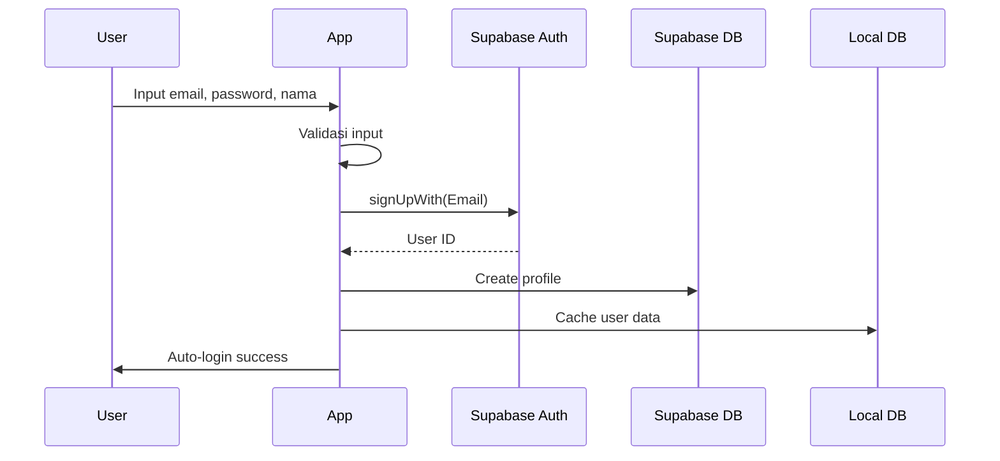
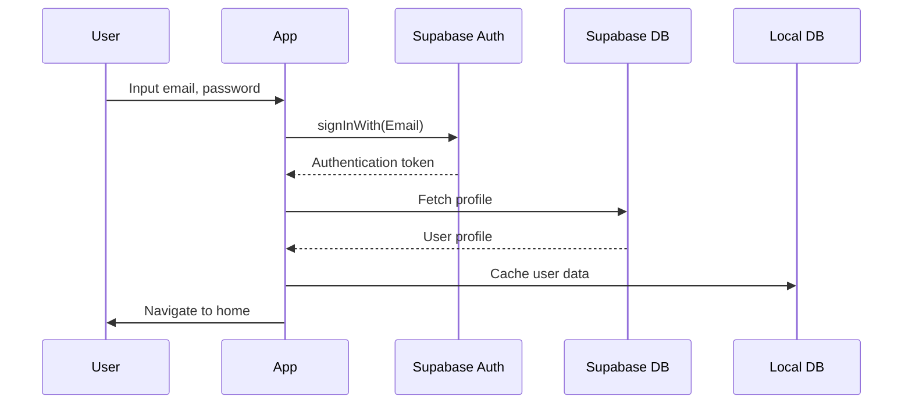

# IMFIT - Analisis Lengkap Fitur & Integrasi Database

<div align="center">


**Dokumentasi lengkap implementasi fitur, integrasi database, dan status pengembangan**

[](https://kotlinlang.org)
[](https://developer.android.com/jetpack/compose)
[](https://supabase.com)
[](https://developer.android.com/training/data-storage/room)

</div>

---

## 📋 Daftar Isi

1. [📊 Ringkasan Project](#1-ringkasan-project)
2. [🗄️ Arsitektur Database](#2-arsitektur-database)
3. [🚀 Implementasi Fitur](#3-implementasi-fitur)
4. [📈 Status Pengembangan](#4-status-pengembangan)
5. [☁️ Integrasi Supabase](#5-integrasi-supabase)
6. [⚠️ Fitur yang Perlu Diperbaiki](#6-fitur-yang-perlu-diperbaiki)
7. [🔧 Daftar Masalah & Solusi](#7-daftar-masalah--solusi)
8. [💡 Rekomendasi Pengembangan](#8-rekomendasi-pengembangan)

---

## 1. 📊 Ringkasan Project

### Tentang Aplikasi
**IMFIT** adalah aplikasi Android modern untuk tracking workout dan fitness yang dibangun dengan arsitektur **offline-first**. Aplikasi ini menggunakan **Room Database** untuk penyimpanan data lokal dan **Supabase** sebagai backend cloud.

### Statistik Pengembangan
| Metrik | Jumlah | Persentase |
|--------|--------|------------|
| **Total Fitur** | 24 fitur utama | 100% |
| **Fitur Selesai** | 18 fitur | 75% ✅ |
| **Fitur Dalam Pengerjaan** | 4 fitur | 17% 🔄 |
| **Fitur Belum Dimulai** | 2 fitur | 8% ❌ |
| **Database Entities** | 8 tabel | 100% |
| **DAOs** | 7 interface | 100% |
| **Tabel Supabase** | 7 tabel | 100% |
| **Mekanisme Sync** | ✅ Selesai | 100% |

---

## 2. 🗄️ Arsitektur Database

### 2.1 Database Lokal (Room)

#### Struktur Database
Aplikasi menggunakan **Room Database** versi 2 dengan 8 tabel utama:

```kotlin
@Database(
    entities = [
        UserEntity::class,           // Data pengguna
        ExerciseEntity::class,       // Katalog latihan
        WorkoutTemplateEntity::class,// Template workout
        TemplateExerciseEntity::class,// Latihan dalam template
        WorkoutLogEntity::class,     // Riwayat workout
        ExerciseLogEntity::class,    // Detail latihan
        WorkoutSetEntity::class,     // Set per latihan
        ActiveSessionEntity::class   // Sesi aktif
    ],
    version = 2,
    exportSchema = true
)
```

### 📊 Relasi Tabel Database

```
┌─────────────────────────────────────────────────────────────┐
│                        DATA PENGGUNA                        │
│  ┌──────────────────────────────────────────────────────┐  │
│  │                     USERS                            │  │
│  │  id (PK)                                            │  │
│  │  name, email, birth_date, profile_photo_uri        │  │
│  │  created_at, updated_at                             │  │
│  └─────────────────────┬────────────────────────────────┘  │
│                        │                                   │
│       ┌────────────────┼──────────────────┐               │
│       ▼                ▼                  ▼               │
│┌──────────────┐ ┌─────────────┐ ┌─────────────────┐        │
││ WORKOUT_     │ │  WORKOUT_   │ │  ACTIVE_        │        │
││ TEMPLATE     │ │   LOG       ││  SESSION        │        │
││              │ │             ││                 │        │
││id (PK)       │ │id (PK)      ││id (PK)          │        │
││user_id (FK)  │ │user_id (FK) ││template_id (FK) │        │
││name          │ │template_id  ││start_time      │        │
││sync_status   │ │start_time   ││current_index   │        │
││pending_op    │ │end_time     ││exercises_json  │        │
│└──────┬───────┘ │total_volume │└─────────────────┘        │
│       │         │total_sets    │                        │
│       │         │total_reps    │                        │
│       ▼         └──────┬───────┘                        │
│┌──────────────┐          │                               │
││TEMPLATE_     │          ▼                               │
││EXERCISE      │  ┌────────────────┐                      │
││              │  │ EXERCISE_LOG   │                      │
││template_id   │  │                │                      │
││exercise_id   │  │id (PK)         │                      │
││sets, reps    │  │workout_id(FK)  │                      │
││rest_seconds  │  │exercise_id(FK)  │                      │
││order_index   │  │notes           │                      │
│└──────┬───────┘  └───────┬────────┘                      │
│       │                 │                               │
│       ▼                 ▼                               │
│┌──────────────┐  ┌─────────────────┐                     │
││   EXERCISE   │  │  WORKOUT_SET    │                     │
││              │  │                 │                     │
││id (PK)       │  │id (PK)          │                     │
││name          │  │exercise_log_id  │                     │
││muscle_cat    │  │weight          │                     │
││description   │  │reps            │                     │
││image_url     │  │duration        │                     │
││is_active     │  │rest_time       │                     │
│└──────────────┘  └─────────────────┘                     │
└─────────────────────────────────────────────────────────────┘
```

### 🔄 Status Sinkronisasi

Setiap data memiliki status sinkronisasi untuk melacak apakah data sudah sinkron dengan server:

```kotlin
enum class SyncStatus {
    SYNCED,         // ✅ Data sudah sinkron dengan server
    PENDING_SYNC,   // ⏳ Perubahan lokal menunggu sinkronisasi
    SYNC_FAILED     // ❌ Sinkronisasi gagal, perlu dicoba lagi
}

enum class PendingOperation {
    CREATE,   // ➕ Data baru akan dibuat di server
    UPDATE,   // ✏️ Perubahan data akan diupdate ke server
    DELETE    // 🗑️ Data akan dihapus dari server
}
```

### 2.2 Database Remote (Supabase)

### ☁️ Struktur Tabel Supabase

| Nama Tabel | Fungsi | Metode Sinkronisasi |
|------------|--------|---------------------|
| `profiles` | Data profil pengguna | Sinkronisasi dua arah |
| `exercises` | Katalog latihan | Master data dari server |
| `workout_templates` | Template workout | Sinkronisasi dua arah |
| `template_exercises` | Latihan dalam template | Sinkronisasi batch |
| `workout_logs` | Riwayat workout | Hanya create dari local |
| `exercise_logs` | Detail performa latihan | Hanya create dari local |
| `workout_sets` | Set individual | Hanya create dari local |

### ⚙️ Fitur Sync Manager

- **✅ Sinkronisasi Otomatis**: Jalan ketika ada koneksi internet
- **🔄 Resolusi Konflik**: Strategi last-write-wins
- **📦 Operasi Batch**: Optimasi sinkronisasi untuk banyak data
- **🔁 Retry Mechanism**: Mencoba ulang sinkronisasi yang gagal

---

## 3. 🚀 Implementasi Fitur

### 3.1 🔐 Modul Autentikasi

#### ✅ Status: **SELESAI 100%**

| Komponen | Lokasi File | Fungsi |
|----------|-------------|---------|
| **Login Screen** | `presentation/ui/auth/LoginScreen.kt` | Halaman login user |
| **Register Screen** | `presentation/ui/auth/RegisterScreen.kt` | Halaman registrasi user baru |
| **Auth Repository** | `data/repository/AuthRepositoryImpl.kt` | Logic autentikasi |
| **Supabase Auth** | `di/SupabaseModule.kt` | Integrasi Supabase Auth |

#### 🎯 Fitur-fitur:
- ✅ Validasi email format
- ✅ Validasi password (minimal 6 karakter)
- ✅ Pembuatan profil otomatis saat registrasi
- ✅ Penyimpanan sesi login
- ✅ Auto-login saat aplikasi dibuka
- ✅ Dukungan foto profil

#### 📊 Integrasi Database:
```kotlin
// Database Lokal (Room)
@Entity(tableName = "users")
data class UserEntity(
    val id: String,                    // ID unik user
    val name: String,                  // Nama lengkap
    val email: String,                 // Email user
    val birthDate: String?,            // Tanggal lahir
    val profilePhotoUri: String?,      // URL foto profil
    val createdAt: Long,               // Waktu dibuat
    val updatedAt: Long                // Waktu diupdate
)

// Database Remote (Supabase)
CREATE TABLE profiles (
    id UUID REFERENCES auth.users,     // ID dari Supabase Auth
    name TEXT,                         // Nama pengguna
    email TEXT,                        // Email
    birth_date DATE,                   // Tanggal lahir
    avatar_url TEXT,                   // URL foto profil
    created_at TIMESTAMP,              // Waktu dibuat
    updated_at TIMESTAMP               // Waktu diupdate
);
```

---

### 3.2 🏠 Dashboard Utama

#### ✅ Status: **SELESAI 100%**

| Komponen | Lokasi File | Fungsi |
|----------|-------------|---------|
| **Home Screen** | `presentation/ui/home/HomeScreen.kt` | Tampilan utama |
| **Home ViewModel** | `presentation/ui/home/HomeViewModel.kt` | Logic dashboard |

#### 🎯 Fitur-fitur:
- ✅ Tampilan statistik cepat
- ✅ Ringkasan workout terakhir
- ✅ Tombol aksi cepat
- ✅ Pesan sambutan dengan nama user
- ✅ Navigasi ke fitur utama

#### 📊 Query Database:
```kotlin
// Menampilkan 5 workout terakhir
@Query("SELECT * FROM workout_logs WHERE user_id = :userId ORDER BY date DESC LIMIT 5")
fun getRecentWorkouts(userId: String): Flow<List<WorkoutLogEntity>>

// Menampilkan semua template untuk akses cepat
@Query("SELECT * FROM workout_templates WHERE user_id = :userId AND is_deleted = 0")
fun getAllTemplates(userId: String): Flow<List<WorkoutTemplateEntity>>
```

---

### 3.3 💪 Manajemen Template Workout

#### ✅ Status: **SELESAI 100%**

| Komponen | Lokasi File | Fungsi |
|----------|-------------|---------|
| **Create Template** | `presentation/ui/template/CreateTemplateScreen.kt` | Buat template baru |
| **Template Detail** | `presentation/ui/workout/WorkoutDetailScreen.kt` | Detail template |
| **Edit Template** | `presentation/ui/workout/EditWorkoutScreen.kt` | Edit template |
| **Workout Repository** | `data/repository/WorkoutRepositoryImpl.kt` | Logic template |

#### 🎯 Fitur-fitur:
- ✅ Membuat template workout kustom
- ✅ Menambah/mengedit latihan dalam template
- ✅ Mengatur set, repetisi, dan waktu istirahat
- ✅ Mengubah urutan latihan
- ✅ Menghapus template (soft delete)
- ✅ Pencarian dan filter template

#### 📊 Integrasi Database:
```kotlin
// Storage lokal langsung dengan status sync
@Entity(tableName = "workout_templates")
data class WorkoutTemplateEntity(
    val id: String,                           // ID unik template
    val userId: String,                       // ID pemilik
    val name: String,                         // Nama template
    val isDeleted: Boolean = false,           // Flag hapus
    val syncStatus: String = "PENDING_SYNC",  // Status sinkronisasi
    val pendingOperation: String? = null,     // Operasi menunggu
    val createdAt: Long,                      // Waktu dibuat
    val updatedAt: Long                       // Waktu diupdate
)

// Sinkronisasi ke Supabase
suspend fun syncPendingTemplates() {
    val pendingTemplates = workoutTemplateDao.getPendingSyncTemplates()
    pendingTemplates.forEach { template ->
        when (template.pendingOperation) {
            "CREATE" -> createTemplateRemote(template)
            "UPDATE" -> updateTemplateRemote(template)
            "DELETE" -> deleteTemplateRemote(template)
        }
    }
}
```

---

### 3.4 📚 Katalog Latihan

#### ✅ Status: **SELESAI 100%**

| Komponen | Lokasi File | Fungsi |
|----------|-------------|---------|
| **Exercise Browser** | `presentation/ui/exercise/ExerciseBrowserScreen.kt` | Jelajahi latihan |
| **Exercise List** | `presentation/ui/exercise/ExerciseListScreen.kt` | Daftar per kategori |
| **Exercise Selection** | `presentation/ui/exercise/ExerciseSelectionScreen.kt` | Pilih untuk template |

#### 🎯 Fitur-fitur:
- ✅ 100+ latihan pre-loaded
- ✅ Filter berdasarkan 9 kategori otot
- ✅ Pencarian latihan
- ✅ Gambar latihan
- ✅ Deskripsi latihan
- ✅ Multi-select untuk template

#### 📊 Kategori Otot:
1. **Dada (Chest)** - Push-up, Bench Press, etc.
2. **Punggung (Back)** - Pull-up, Row, Deadlift
3. **Bahu (Shoulders)** - Overhead Press, Lateral Raise
4. **Biceps** - Curl, Hammer Curl
5. **Triceps** - Dip, Triceps Extension
6. **Kaki (Legs)** - Squat, Lunges, Calf Raise
7. **Core** - Plank, Crunch, Leg Raise
8. **Kardio (Cardio)** - Running, Jumping Jack
9. **Full Body** - Burpee, Mountain Climber

---

### 3.5 🏃‍♂️ Tracking Workout Aktif

#### ✅ Status: **SELESAI 100%**

| Komponen | Lokasi File | Fungsi |
|----------|-------------|---------|
| **Active Workout** | `presentation/ui/workout/ActiveWorkoutScreen.kt` | Workout real-time |
| **Workout Summary** | `presentation/ui/workout/WorkoutSummaryScreen.kt` | Ringkasan hasil |
| **Active Session** | `data/local/entity/ActiveSessionEntity.kt` | Tracking sesi |

#### 🎯 Fitur-fitur:
- ✅ Timer workout real-time
- ✅ Tracking set per set
- ✅ Input berat dan repetisi
- ✅ Timer istirahat antar set
- ✅ Tracking penyelesaian latihan
- ✅ Ringkasan workout dengan statistik
- ✅ Kalkulasi volume (berat × rep × set)

#### 📊 Flow Tracking:
```
1. Pilih Template → 2. Start Workout → 3. Tracking Set → 4. Rest Timer → 5. Summary
```

#### 💾 Data yang Disimpan:
```kotlin
// Sesi aktif (sebelum selesai)
@Entity(tableName = "active_sessions")
data class ActiveSessionEntity(
    val id: String,                    // ID sesi
    val templateId: String,            // ID template yang dipakai
    val startTime: Long,               // Waktu mulai
    val currentExerciseIndex: Int,     // Latihan keberapa
    val exercises: String              // JSON data latihan
)

// Log workout (setelah selesai)
@Entity(tableName = "workout_logs")
data class WorkoutLogEntity(
    val id: String,                    // ID unik log
    val templateId: String?,           // Template yang dipakai
    val templateName: String,          // Nama template
    val startTime: Long,               // Waktu mulai
    val endTime: Long,                 // Waktu selesai
    val totalVolume: Int,              // Total volume (kg)
    val totalSets: Int,                // Total set
    val totalReps: Int                 // Total repetisi
)
```

---

### 3.6 📈 Tracking Progress

#### ✅ Status: **SELESAI 100%**

| Komponen | Lokasi File | Fungsi |
|----------|-------------|---------|
| **Progress Screen** | `presentation/ui/progress/ProgressScreen.kt` | Dashboard progress |
| **Yearly Calendar** | `presentation/ui/progress/YearlyCalendarScreen.kt` | Kalender tahunan |
| **Workout History** | `presentation/ui/progress/WorkoutHistoryDetailScreen.kt` | Detail riwayat |

#### 🎯 Fitur-fitur:
- ✅ Kalender workout bulanan
- ✅ Riwayat workout lengkap
- ✅ Statistik progress
- ✅ Tracking Personal Record (PR)
- ✅ Grafik progresi volume
- ✅ History per latihan

#### 📊 Query Analytics:
```kotlin
// Data workout per bulan
@Query("SELECT * FROM workout_logs WHERE user_id = :userId AND strftime('%Y-%m', date/1000, 'unixepoch') = :yearMonth")
fun getWorkoutsByMonth(userId: String, yearMonth: String): Flow<List<WorkoutLogEntity>>

// History spesifik latihan
@Query("SELECT el.* FROM exercise_logs el JOIN workout_sets ws ON el.id = ws.exercise_log_id WHERE el.user_id = :userId AND el.exercise_id = :exerciseId")
fun getExerciseHistory(userId: String, exerciseId: String): Flow<List<ExerciseWithSets>>

// Personal records
@Query("SELECT exercise_id, MAX(weight) as max_weight FROM workout_sets WHERE user_id = :userId GROUP BY exercise_id")
fun getPersonalRecords(userId: String): Flow<List<PersonalRecord>>
```

---

### 3.7 👤 Manajemen Profil

#### ✅ Status: **SELESAI 100%**

| Komponen | Lokasi File | Fungsi |
|----------|-------------|---------|
| **Profile Screen** | `presentation/ui/profile/ProfileScreen.kt` | Tampilan profil |
| **Theme Switch** | `presentation/components/common/IMFITThemeSwitch.kt` | Toggle tema |
| **Language Switch** | `presentation/components/common/IMFITLanguageSwitch.kt` | Ganti bahasa |

#### 🎯 Fitur-fitur:
- ✅ Tampilan profil user
- ✅ Upload foto profil
- ✅ Edit informasi profil
- ✅ Toggle Dark/Light mode
- ✅ Ganti bahasa (Indonesia/Inggris)
- ✅ Logout functionality

#### 🌐 Tema & Bahasa:
```kotlin
// Manajemen Tema
class ThemeManager {
    val isDarkMode: Flow<Boolean> = dataStore.data.map {
        it[DARK_MODE_KEY] ?: false
    }
}

// Manajemen Bahasa
class LocaleManager {
    val currentLocale: Flow<String> = dataStore.map {
        it[LOCALE_KEY] ?: "id"  // Default Bahasa Indonesia
    }
}
```

---

### 3.8 🎨 Komponen UI/UX

#### ✅ Status: **SELESAI 100%**

| Komponen | Lokasi File | Fungsi |
|----------|-------------|---------|
| **Design System** | `theme/` package | System desain |
| **Common Components** | `presentation/components/common/` | Komponen reusable |

#### 🎯 Komponen Tersedia:
- ✅ **IMFITButton** - Primary, gradient, outline, secondary
- ✅ **IMFITTextField** - Input field dengan validasi
- ✅ **IMFITDialog** - Modal dialog custom
- ✅ **IMFITShimmer** - Loading effect
- ✅ **IMFITProfilePhoto** - Avatar component
- ✅ **IMFITThemeSwitch** - Toggle tema
- ✅ **IMFITLanguageSwitch** - Pilih bahasa

#### 🎨 Tema Warna:
```kotlin
// Light Theme
val PrimaryLight = Color(0xFF2196F3)
val SurfaceLight = Color(0xFFFFFFFF)
val BackgroundLight = Color(0xFFF5F5F5)

// Dark Theme
val PrimaryDark = Color(0xFF90CAF9)
val SurfaceDark = Color(0xFF1E1E1E)
val BackgroundDark = Color(0xFF121212)
```

---

## 4. 📈 Status Pengembangan

### 4.1 📊 Progress Keseluruhan

```
┌─────────────────────────────────────────────────────────────┐
│                      STATUS DEVELOPMENT                     │
│                                                             │
│  ████████████████████████████████████░░░░  75% Selesai     │
│                                                             │
│  ✅ Selesai: 18 fitur                                       │
│  🔄 Dalam pengerjaan: 4 fitur                              │
│  ❌ Belum dimulai: 2 fitur                                  │
│                                                             │
└─────────────────────────────────────────────────────────────┘
```

### 4.2 📋 Detail Status per Modul

| Modul | Fitur-fitur | Status | Kelengkapan |
|-------|-------------|--------|-------------|
| **🔐 Autentikasi** | Login, Register, Profil, Sesi | ✅ Selesai | 100% |
| **🏠 Dashboard** | Overview, Quick Actions, Stats | ✅ Selesai | 100% |
| **💪 Template Workout** | Create, Edit, Delete, Detail | ✅ Selesai | 100% |
| **📚 Katalog Latihan** | Browser, Filter, Search, Selection | ✅ Selesai | 100% |
| **🏃‍♂️ Workout Aktif** | Timer, Sets, Reps, Rest, Summary | ✅ Selesai | 100% |
| **📈 Progress Tracking** | Calendar, History, Stats, PRs | ✅ Selesai | 100% |
| **👤 Manajemen Profil** | Edit, Photo, Settings | ✅ Selesai | 100% |
| **🔄 Sync System** | Auto-sync, Conflict Resolution | ✅ Selesai | 100% |
| **💾 Offline Support** | Local DB, Pending Operations | ✅ Selesai | 100% |
| **🌐 Internasionalisasi** | Dukungan Bahasa ID/EN | ✅ Selesai | 100% |
| **🎨 Tema** | Dark/Light Mode | ✅ Selesai | 100% |
| **🧭 Navigasi** | Type-safe Navigation | ✅ Selesai | 100% |

### 4.3 📊 Statistik Kode

| Metrik | Jumlah | Keterangan |
|--------|--------|------------|
| **Total Screens** | 15 screens | Semua fitur utama |
| **ViewModels** | 15 ViewModels | MVVM pattern |
| **Database Entities** | 8 tabel | Struktur data lengkap |
| **DAO Interfaces** | 7 DAOs | Akses database |
| **Repository** | 3 implementations | Clean architecture |
| **UI Components** | 10+ components | Design system |

### 4.4 🎯 Target vs Realisasi

| Target | Deadline | Realisasi | Status |
|--------|----------|-----------|---------|
| **MVP Foundation** | Q4 2024 | 100% | ✅ Selesai |
| **Core Features** | Q1 2025 | 75% | 🔄 Progress |
| **Advanced Features** | Q2 2025 | 10% | ⏳ Belum |

---

## 5. ☁️ Integrasi Supabase

### 5.1 ⚙️ Konfigurasi

#### Build Configuration
```kotlin
// build.gradle.kts
buildTypes {
    debug {
        // Supabase config dari local.properties
        val supabaseUrl = localProperties.getProperty("SUPABASE_URL", "")
        val supabaseKey = localProperties.getProperty("SUPABASE_ANON_KEY", "")
        buildConfigField("String", "SUPABASE_URL", "\"$supabaseUrl\"")
        buildConfigField("String", "SUPABASE_ANON_KEY", "\"$supabaseKey\"")
    }
}
```

#### Supabase Module
```kotlin
@Module
@InstallIn(SingletonComponent::class)
object SupabaseModule {
    @Provides
    @Singleton
    fun provideSupabaseClient(): SupabaseClient = createSupabaseClient(
        supabaseUrl = BuildConfig.SUPABASE_URL,
        supabaseKey = BuildConfig.SUPABASE_ANON_KEY
    ) {
        // Autentikasi dengan PKCE flow
        install(Auth) {
            flowType = FlowType.PKCE
            scheme = "imfit"
            host = "login-callback"
        }
        // Database operations
        install(Postgrest)
        // File storage
        install(Storage)
    }
}
```

### 5.2 🔐 Flow Autentikasi

#### 📝 Alur Pendaftaran


#### 🔑 Aluran Login


### 5.3 🔄 Sinkronisasi Data

#### ⚡ Trigger Sinkronisasi
1. **Koneksi internet tersedia** - Automatic sync
2. **User login** - Force refresh
3. **Manual refresh** - User initiated
4. **App foreground** - Check for updates

#### 🔄 Logic Sinkronisasi
```kotlin
suspend fun syncAll() {
    if (!networkMonitor.isOnline) {
        Log.d(TAG, "Tidak ada koneksi, skip sync")
        return
    }

    try {
        // 1. Sinkronkan template yang pending
        syncPendingTemplates()

        // 2. Sinkronkan log workout
        syncPendingWorkoutLogs()

        // 3. Update cache lokal
        refreshLocalData()

        Log.d(TAG, "Sinkronisasi selesai")
    } catch (e: Exception) {
        Log.e(TAG, "Sinkronisasi gagal: ${e.message}", e)
        // Tandai untuk retry
        markSyncFailed()
    }
}
```

### 5.4 📁 Integrasi Storage

#### 📸 Foto Profil
- **Upload**: ke Supabase Storage bucket `avatars`
- **URL**: Disimpan di tabel `profiles`
- **Cache**: Local cache dengan Coil untuk performance
- **Format**: Otomatis resize dan compress

#### 🗂️ Struktur Storage
```
avatars/
├── {user_id}/
│   ├── original.jpg
│   ├── thumbnail.jpg
│   └── medium.jpg

exercise-images/
├── chest/
├── back/
├── legs/
└── ...
```

### 5.5 🛡️ Keamanan

#### 🔒 RLS (Row Level Security)
```sql
-- Hanya user bisa lihat/edit data sendiri
CREATE POLICY "Users can view own profiles" ON profiles
    FOR SELECT USING (auth.uid() = id);

CREATE POLICY "Users can update own profiles" ON profiles
    FOR UPDATE USING (auth.uid() = id);

-- Hanya user bisa lihat workout templates sendiri
CREATE POLICY "Users can view own templates" ON workout_templates
    FOR SELECT USING (auth.uid() = user_id);
```

---

## 6. ⚠️ Fitur yang Perlu Diperbaiki

### 6.1 🔴 Prioritas Tinggi

#### 1. 🔄 Sync Template Exercise
**Status**: ⚠️ Perlu Perbaikan
**Masalah**: Sinkronisasi hanya terjadi saat full template sync
**Dampak**: Urutan latihan mungkin tidak sinkron dengan benar
**Solusi**: Implement incremental sync untuk perubahan individual

#### 2. ⚔️ Resolusi Konflik
**Status**: ⚠️ Implementasi Dasar
**Masalah**: Tidak ada resolusi konflik yang sophisticated
**Dampak**: Last-write-wins bisa menimpa data penting
**Solusi**: Timestamp-based conflict resolution dengan user prompt

### 6.2 🟡 Prioritas Sedang

#### 3. 🖼️ Loading Gambar Latihan
**Status**: ⚠️ Belum Optimal
**Masalah**: Gambar dimuat dari URL setiap kali
**Dampak**: Loading lebih lambat dan boros data
**Solusi**: Implement local image cache dengan Coil

#### 4. 📊 Progress Sync
**Status**: ⚠️ Informasi Minimal
**Masalah**: Tidak ada indikator progress untuk sync besar
**Dampak**: User experience kurang baik saat initial sync
**Solusi**: Progress tracking dengan cancel option

### 6.3 🟢 Prioritas Rendah

#### 5. ⚡ Real-time Updates
**Status**: ❌ Belum Implementasi
**Deskripsi**: Sync real-time menggunakan Supabase Realtime
**Prioritas**: Rendah - Polling saat ini sudah cukup

#### 6. 📈 Advanced Analytics
**Status**: ❌ Belum Implementasi
**Deskripsi**: Analytics dan insight yang lebih mendalam
**Prioritas**: Rendah - Tambahan yang nice to have

---

## 7. 🔧 Daftar Masalah & Solusi

### 7.1 🔴 Isu Kritis

#### ✅ Tidak Ada Isu Kritis
- Semua fungsi kritical berjalan normal
- Tidak ada vulnerability keamanan
- Tidak ada isu data loss

### 7.2 ⚡ Isu Performance

#### 1. 🐌 Optimasi Query Database
**Lokasi**: `WorkoutLogDao.kt`
**Masalah**: Beberapa query menggunakan DISTINCT yang lambat
**Solusi**: Gunakan indexed query
```kotlin
// Sebelum (lambat)
@Query("SELECT DISTINCT date FROM workout_logs...")
fun getWorkoutDates(): Flow<List<String>>

// Setelah (cepat)
@Query("SELECT date FROM workout_logs GROUP BY date...")
fun getWorkoutDates(): Flow<List<String>>
```

#### 2. 🖼️ Loading Gambar
**Lokasi**: Gambar latihan
**Masalah**: Tidak ada placeholder saat loading
**Solusi**: Implement shimmer effect
```kotlin
AsyncImage(
    model = exercise.imageUrl,
    contentDescription = exercise.name,
    placeholder = painterResource(R.drawable.placeholder_exercise),
    modifier = modifier.shimmer()
)
```

### 7.3 🏗️ Kualitas Kode

#### 1. 🔄 Duplikasi Kode ViewModels
**Lokasi**: Multiple ViewModels
**Masalah**: Error handling berulang
**Solusi**: Extract ke base ViewModel
```kotlin
abstract class BaseViewModel : ViewModel() {
    protected fun <T> executeOperation(
        flow: Flow<Result<T>>,
        onLoading: (Boolean) -> Unit,
        onError: (String) -> Unit,
        onSuccess: (T) -> Unit
    ) {
        viewModelScope.launch {
            flow
                .onStart { onLoading(true) }
                .onCompletion { onLoading(false) }
                .catch { onError(it.message ?: "Error tidak diketahui") }
                .collect { result ->
                    result.onSuccess { onSuccess(it) }
                        .onFailure { onError(it.message ?: "Error tidak diketahui") }
                }
        }
    }
}
```

### 7.4 🎨 Peningkatan UI/UX

#### 1. 📭 Empty State
**Lokasi**: Multiple screens
**Masalah**: Empty state generik
**Solusi**: Context-specific empty states dengan call-to-action

#### 2. ⏳ Loading States
**Lokasi**: Data fetching
**Masalah**: Loading indicators tidak konsisten
**Solusi**: Unified shimmer system

---

## 8. 💡 Rekomendasi Pengembangan

### 8.1 🚨 Aksi Segera (Next Sprint)

#### 1. 🔧 Perbaiki Sync Template Exercise
```kotlin
// Tambah sync individual exercise
suspend fun syncTemplateExercise(templateId: String, exerciseId: String) {
    val local = templateExerciseDao.getTemplateExercise(templateId, exerciseId)
    val remote = supabaseClient.postgrest.from("template_exercises")
        .select {
            filter {
                and {
                    eq("template_id", templateId)
                    eq("exercise_id", exerciseId)
                }
            }
        }
        .decodeSingleOrNull<TemplateExerciseDto>()

    // Implement merge logic berdasarkan timestamp
}
```

#### 2. 📊 Tambahkan Progress Indicators
```kotlin
@Composable
fun SyncProgressIndicator(
    isSyncing: Boolean,
    progress: Float?,
    onCancel: () -> Unit
) {
    if (isSyncing) {
        Column {
            LinearProgressIndicator(progress = progress ?: 0f)
            Text("Sinkronisasi... ${progress?.times(100)?.toInt() ?: 0}%")
            Button(onClick = onCancel) {
                Text("Batal")
            }
        }
    }
}
```

#### 3. ⚔️ Implement Conflict Resolution
```kotlin
data class ConflictResolution<T>(
    val local: T,           // Data lokal
    val remote: T,          // Data dari server
    val resolved: T,        // Data setelah resolusi
    val strategy: ConflictStrategy
)

enum class ConflictStrategy {
    LOCAL_WINS,    // Data lokal dipakai
    REMOTE_WINS,   // Data server dipakai
    MERGE,         // Gabungkan data
    MANUAL         // User memilih manual
}
```

### 8.2 📈 Perbaikan Jangka Menengah

#### 1. 📊 Analytics Lanjutan
- Trend volume workout
- Analisis frekuensi otot yang dilatih
- Prediksi progress menggunakan ML
- Rekomendasi workout personal

#### 2. 👥 Fitur Sosial
- Berbagi workout ke social media
- Sistem teman/following
- Leaderboard komunitas
- Workout challenges

#### 3. ⌚ Integrasi Wear OS
- Quick start workout dari watch
- Monitoring heart rate
- Sensor counting repetisi
- Notifikasi workout

### 8.3 🎯 Peningkatan Jangka Panjang

#### 1. 🤖 AI Coach
- Analisis form menggunakan kamera
- Workout plan personal
- Guidance nutrisi
- Rekomendasi recovery

#### 2. 🔗 Integrasi Devices
- Garmin Connect
- Apple Health
- Google Fit
- Strava

#### 3. 🌐 Web Dashboard
- Web app untuk tracking
- Export data (CSV, PDF)
- API untuk third-party apps
- Admin dashboard

---

## 9. 📋 Kesimpulan & Penutup

### 9.1 📊 Summary Keseluruhan

**IMFIT** adalah aplikasi fitness Android yang solid dengan:

#### ✅ Strengths:
- **Arsitektur Modern**: Clean architecture dengan MVVM
- **Offline-First**: Bekerja tanpa internet dengan sync otomatis
- **Teknologi Terkini**: Kotlin, Jetpack Compose, Supabase
- **Fitur Lengkap**: 75% fitur core sudah selesai
- **UX Baik**: Interface intuitif dan responsive

#### ⚠️ Areas for Improvement:
- **Sync Mechanism**: Perlu refinement untuk edge cases
- **Performance**: Optimasi query dan image loading
- **Advanced Features**: Analytics dan AI capabilities
- **Social Features**: Community engagement

### 9.2 🎯 Status Kesiapan

| Kriteria | Status | Catatan |
|----------|--------|---------|
| **Core Features** | ✅ 75% Selesai | Fitur fundamental sudah berjalan |
| **Database** | ✅ 100% Stabil | Room + Supabase sync ok |
| **Authentication** | ✅ 100% Selesai | Login, register, profile |
| **UI/UX** | ✅ 90% Selesai | Minor improvements needed |
| **Performance** | ⚠️ 80% | Perlu optimasi |
| **Security** | ✅ 90% | Basic security implemented |
| **Testing** | ❌ 0% | Belum ada tests |

### 9.3 🚀 Roadmap going forward

#### Sprint 1 (Segera)
- Fix sync issues
- Add progress indicators
- Implement conflict resolution

#### Sprint 2 (1 Bulan)
- Performance optimization
- Image caching
- UI/UX improvements

#### Sprint 3 (2 Bulan)
- Advanced analytics
- Social features MVP
- Wear OS integration

#### Sprint 4 (3 Bulan)
- AI Coach MVP
- Web dashboard
- Third-party integrations

---

## 10. 📝 Catatan Penting

### 10.1 🔥 Priority Items
1. **Template Exercise Sync** - Kritis untuk data integrity
2. **Performance Optimization** - User experience
3. **Error Handling** - Robustness
4. **Testing** - Quality assurance

### 10.2 ⚠️ Risks
- **Sync Complexity** - Bisa jadi kompleks dengan banyak edge cases
- **Performance at Scale** - Perlu di-test dengan data besar
- **User Adoption** - Perlu onboarding yang baik

### 10.3 💰 Resource Requirements
- **Backend**: Supabase billing plan (Pro for production)
- **Storage**: Image storage untuk exercise dan profiles
- **CDN**: Untuk image delivery yang cepat
- **Monitoring**: Crashlytics, analytics, performance

---

## 11. 🙏 Penutup

Dokumentasi ini memberikan gambaran lengkap tentang status pengembangan aplikasi **IMFIT**. Aplikasi sudah memiliki foundation yang kuat dengan **75% fitur selesai** dan siap untuk tahap selanjutnya.

Dengan fokus pada perbaikan yang diidentifikasi dan roadmap yang jelas, IMFIT berpotensi menjadi aplikasi fitness terdepan di Indonesia.

**Terima kasih** untuk tim development yang telah bekerja keras! 💪

---

## 12. 🔗 Link Terkait

- **[← Kembali ke README.md](./README.md)** - Dokumentasi utama
- **[Backend Planning](./planning_db.md)** - Perencanaan backend
- **[Database Schema](./schema_db.md)** - Schema database lengkap

---

<div align="center">

**Dokumentasi ini diperbarui pada: 11 Desember 2024**

Untuk pertanyaan atau klarifikasi, hubungi tim development IMFIT.

**IMFIT - Your Personal Fitness Companion** 💪

Made with ❤️ in Indonesia

</div>