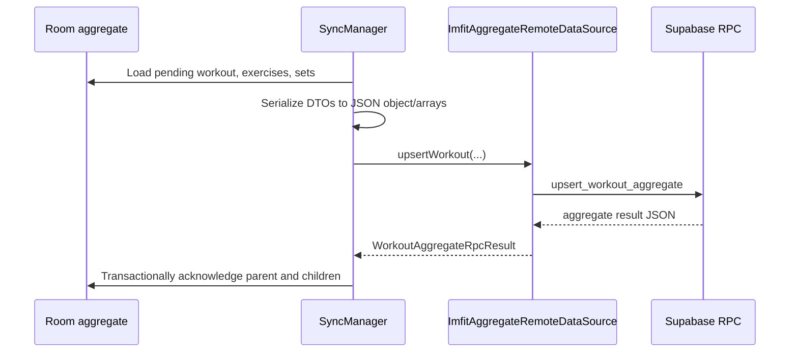

# IMFIT Supabase and Compose Integration

**Status:** Implemented - partially runtime-tested  
**Scope:** `app` Android module, `production` flavor, Supabase project backend migrations  
**Last updated:** 2026-08-29  
**Migration tooling commit:** `466f12a chore(supabase): baseline and harden IMFIT backend`

## Purpose

This document records the actual before/after state of the IMFIT Android-to-Supabase integration. It covers the Supabase schema and security hardening, the production Compose/Android integration, and the local cleanup behavior on logout.

It does not describe future delta-sync work as implemented. Existing pull methods still fetch whole remote collections; no `updated_at` filter, child-record update reconciliation, or child `deleted_at` tombstone protocol has been added.

## Runtime Verification

The following external checks were performed in the Supabase SQL Editor on the linked project:

| Check | Result | Evidence Type | Confidence |
| --- | --- | --- | --- |
| Migration ledger | `20260828130114`, `20260828130132`, and `20260828130154` are recorded | runtime-sample | Verified |
| Workout RPC | `upsert_workout_aggregate(jsonb,jsonb,jsonb)` is present | runtime-sample | Verified |
| Template RPC | `upsert_template_aggregate(jsonb,jsonb)` is present | runtime-sample | Verified |
| Catalog | 8 `muscle_categories` and 81 `exercises` rows | runtime-sample | Verified |
| Production APK install | `com.diajarkoding.imfit` installed on emulator | runtime-sample | Verified |
| Deep-link resolution | `imfit://auth` cold-started `MainActivity` and Android package resolution found that activity | runtime-sample | Verified |

> ⚠️ TODO/VERIFY: A real email confirmation callback containing a valid PKCE code has not yet been tested. `Confirm email` must remain off until that end-to-end test is ready.

> ⚠️ TODO/VERIFY: The Supabase CLI is linked, but `npx supabase migration list` fails in passwordless mode while the hosted service tries to alter `cli_login_postgres`. The remote migration ledger was verified through SQL Editor instead. Do not run `db push`.

## Before and After

| Area | Before | Current implementation |
| --- | --- | --- |
| Schema source control | Schema/seed/hardening SQL was outside standard CLI migration discovery | Three timestamped files are tracked in `supabase/migrations/` and recorded remotely |
| Workout push | `SyncManager` issued separate PostgREST upserts for `workout_logs`, every `exercise_logs` row, and every `workout_sets` row | One `upsert_workout_aggregate` RPC receives the whole aggregate; server work is one PostgreSQL transaction |
| Failure acknowledgement | Failed workout push changed the parent to `SYNC_FAILED` | Failed RPC is rethrown to sync orchestration without changing acknowledgement rows; pending operation remains retryable |
| Registration result | Missing session after signup was returned as an error | `RegisterResult` distinguishes `Authenticated` from `CheckEmail` |
| Auth callback | PKCE host was `login-callback`; no Android callback handler | Production uses `imfit://auth`, Android intent filter, `handleDeeplinks`, and Main navigation reset |
| Logout | Cancels WorkManager only, signs out, and keeps Room/DataStore user state | Blocks sync, cancels user work, deletes user-scoped Room data, clears user sync keys, then signs out |
| Cross-user active session | Singleton in-memory session and unscoped DAO fallback could expose an earlier user's session | Cached session is associated with an authenticated user; unscoped fallback is removed from restoration/rest settings paths |

## Supabase Backend

### Migration Inventory

| Version | File | Applied purpose |
| --- | --- | --- |
| `20260828130114` | `supabase/migrations/20260828130114_imfit_schema_baseline.sql` | Creates application tables, foreign keys, constraints, indexes, and private storage buckets |
| `20260828130132` | `supabase/migrations/20260828130132_imfit_catalog_seed.sql` | Upserts eight muscle categories and 81 exercises |
| `20260828130154` | `supabase/migrations/20260828130154_imfit_backend_hardening.sql` | Applies grants/RLS, timestamp and ownership triggers, storage policies, indexes, and aggregate RPCs |

The migration files use `create ... if not exists` or conflict-safe writes where applicable. The baseline comment explicitly identifies it as suitable both for recording a manually-created schema and bootstrapping a fresh project.

### Data Model

The baseline declares these application tables:

| Group | Tables | Ownership / relation |
| --- | --- | --- |
| User profile | `profiles` | `profiles.id` references `auth.users(id)` |
| Global catalog | `muscle_categories`, `exercises` | `exercises.muscle_category_id` references category; authenticated users can read only |
| Templates | `workout_templates`, `template_exercises` | Template belongs to `auth.users`; template exercise belongs to template and catalog exercise |
| Completed workout | `workout_logs`, `exercise_logs`, `workout_sets` | Workout belongs to user; exercise log belongs to workout; set belongs to exercise log and also stores workout/exercise references |
| Active state | `active_sessions` | One active session per user; references a template |

`workout_logs.deleted_at` is the existing server-side soft-delete field. No child `deleted_at` fields were added.

### Access Control and RLS

Migration `20260828130154` removes table privileges from `anon`, gives `authenticated` only the required table operations, and enables RLS for all exposed application tables.

| Resource | Authenticated access |
| --- | --- |
| `profiles` | Select, insert, update only when row `id = auth.uid()` |
| `workout_templates`, `workout_logs`, `active_sessions` | CRUD only when `user_id = auth.uid()` |
| `template_exercises`, `exercise_logs`, `workout_sets` | CRUD only when their parent aggregate belongs to `auth.uid()` |
| `muscle_categories`, `exercises` | Select for any authenticated user; no mutation grant |
| `storage.objects` in `avatars` | Select/insert/update/delete only in the authenticated user's first-level folder |

The hardening migration also:

- Sets `updated_at` through `public.update_updated_at_column()` triggers.
- Creates `public.handle_new_user()` on `auth.users` to insert an idempotent profile from name and optional birth-date metadata.
- Adds `validate_owned_template_reference()` triggers to prevent a workout log or active session from referencing another user's template.
- Limits `avatars` to 5 MiB and JPEG, PNG, or WebP content types.
- Adds compound indexes intended for future `updated_at` sync queries. Their presence does not mean delta pulls are active in Android.

### Aggregate RPC Contract

`public.upsert_workout_aggregate(p_workout jsonb, p_exercises jsonb, p_sets jsonb)` is the active workout write contract.

The server function:

1. Requires `auth.uid()`.
2. Validates `p_workout` is an object and child payloads are arrays.
3. Requires a UUID workout ID and rejects a supplied `user_id` different from the session user.
4. Upserts the workout with the authenticated user as owner.
5. Upserts submitted exercise logs with the submitted workout as parent.
6. Rejects a set whose `exercise_log_id` does not belong to that workout.
7. Upserts submitted sets and returns `workout_id`, `exercise_count`, `set_count`, and `server_updated_at` as JSON.

The function is `security invoker`, has a fixed empty `search_path`, and is executable by `authenticated` and `service_role`, not `anon`.

`public.upsert_template_aggregate(p_template jsonb, p_exercises jsonb)` also exists remotely, but the Android template push still uses its previous replacement flow. It is intentionally not called by current client code because Room template exercises have no persistent remote child UUID and the RPC does not prune omitted remote children.

> ⚠️ TODO/VERIFY: Do not switch template sync to `upsert_template_aggregate` until template child identities and removal semantics are designed, persisted in Room, and tested.

## Android Production Integration

### Dependencies and Configuration

The Android version catalog declares Supabase Kotlin BOM `3.0.3` and the app includes PostgREST, Auth, Storage, Ktor, and Kotlin serialization dependencies in `app/build.gradle.kts`.

`production` reads `SUPABASE_URL` and `SUPABASE_ANON_KEY` from ignored `local.properties` into `BuildConfig`. No service-role key is used by the Android client.

`SupabaseModule.provideSupabaseClient()` configures:

```kotlin
install(Auth) {
    flowType = FlowType.PKCE
    scheme = "imfit"
    host = "auth"
}
```

It also installs PostgREST and Storage.

### Workout Push Flow



`ImfitAggregateRemoteDataSource` serializes its parameter wrapper to a `JsonObject` because Supabase Kotlin `postgrest.rpc()` expects a JSON object. `SyncManager.syncWorkoutAggregate()` serializes the pre-existing private workout DTOs with `encodeDefaults = true` and `explicitNulls = false`.

On successful RPC response, the Room transaction calls `WorkoutLogDao.markAsSyncedIfUnchanged()` for the parent. Only if that guarded update changed one row does it clear child pending state with `markWorkoutExerciseLogsAsSynced()` and `markWorkoutSetsAsSynced()`.

If RPC serialization, network transport, PostgREST, or decoding throws, `syncWorkoutAggregate()` rethrows. `syncPendingWorkoutLogs()` records the failure in aggregate sync state but does not mark the workout aggregate as synced or set its parent status to `SYNC_FAILED`.

WorkManager work is unique per user, requires a connected network, and has exponential backoff starting at 10 seconds. `SyncManager` also observes network availability and serializes all runs with `syncMutex`.

### Registration and Email Confirmation

The domain contract is:

```kotlin
sealed interface RegisterResult {
    data class Authenticated(val user: User) : RegisterResult
    data object CheckEmail : RegisterResult
}
```

`AuthRepositoryImpl.register()` calls `signUpWith(Email)` with `name` and optional `birth_date` in user metadata. It checks `currentUserOrNull()` after signup:

- A session returns `Authenticated` after optional avatar upload and profile update.
- No session returns `CheckEmail` without trying to write profile data or upload to private storage.

`RegisterViewModel` validates an eight-or-more-character password with at least one uppercase character, lowercase character, and digit. Its `RegisterState.registerResult` is consumed by `RegisterScreen`:

| Result | Compose navigation |
| --- | --- |
| `Authenticated` | Resets to `Main` |
| `CheckEmail` | Resets to `RegisterConfirmation` |

`RegisterConfirmationScreen` uses `register_confirmation_title`, `register_confirmation_message`, and `register_confirmation_login` resources. The selected pre-confirmation avatar URI is not persisted or uploaded; the user must choose an avatar later while authenticated.

### Android Deep Link and Callback

The `production` source-set manifest augments `MainActivity` with `singleTop` and an `ACTION_VIEW` filter for scheme `imfit` and host `auth`. The demo flavor has a no-op `DemoAuthDeepLinkHandler` and does not claim the scheme.

`MainActivity` sends both `onCreate` and `onNewIntent` intents to `AuthDeepLinkHandler`. The production implementation:

1. Ignores URIs other than `imfit://auth`.
2. Calls `SupabaseClient.handleDeeplinks(intent)`.
3. When Supabase imports a session, unblocks/schedules that user sync.
4. Calls back to `MainActivity`, which sets Compose state.
5. `NavGraph` observes the state and resets its Navigation 3 stack to `Main`.

The route `RegisterConfirmation` exists solely for the no-session signup result. A confirmed PKCE callback is designed to enter `Main` automatically.

### Logout Cleanup

`AuthRepositoryImpl.logout()` captures the current user ID before session changes and performs this order:

```text
cancel unique WorkManager sync
-> block and drain SyncManager
-> delete user-scoped Room data in one transaction
-> clear that user's DataStore sync keys
-> clear cached user
-> Supabase signOut
```

`SyncManager.blockAndAwaitIdle()` adds the user to a synchronized blocked-user set before acquiring `syncMutex`. New worker or network-observer runs for that user return without syncing; an existing run leaves the mutex before deletion begins.

`IMFITDatabase.deleteUserData()` deletes, in one Room transaction:

1. `workout_sets` belonging to the user's workout logs.
2. `exercise_logs` belonging to those logs.
3. `workout_logs`.
4. `template_exercises` belonging to the user's templates.
5. `workout_templates`.
6. `active_sessions`.
7. The local `users` row.

It never deletes `exercises`. There is no local Room `muscle_categories` table; muscle categories are represented by the domain enum.

`SyncPreferences.clearForUser()` removes only the five dynamic keys for the user:

- `last_sync_timestamp_<userId>`
- `last_templates_sync_<userId>`
- `last_workout_logs_sync_<userId>`
- `last_exercises_sync_<userId>`
- `initial_sync_completed_<userId>`

`WorkoutRepositoryImpl` associates its cached `WorkoutSession` with the authenticated user and no longer restores an active session through `getAnyActiveSession()` when unauthenticated.

> ⚠️ TODO/VERIFY: Logout does not explicitly stop `WorkoutService`. Test logout while an active workout notification/service exists before treating this flow as complete.

## Dashboard Configuration

The code and manifest require this exact callback URI:

```text
imfit://auth
```

Observed dashboard state during setup:

- Redirect URL `imfit://auth` was added.
- The dashboard previously displayed Site URL `io.supabase.imfit://login-callbac`; it must be changed to `imfit://auth` and saved before end-to-end email confirmation testing.
- Email provider is enabled.

Required but not yet verified dashboard settings:

| Setting | Required value |
| --- | --- |
| Allow new users to sign up | Enabled |
| Allow manual linking | Disabled |
| Allow anonymous sign-ins | Disabled |
| Confirm email | Enable only after deep-link callback test is ready |
| Email minimum password length | 8 |
| Password requirements | Uppercase, lowercase, and digit |
| Leaked-password protection | Unavailable on current Free plan; leave disabled |

The built-in Supabase email sender has rate limits and is not suitable for production delivery. Custom SMTP is not configured in this repository.

## Tests and Verification Matrix

### Completed

| Check | Result | Evidence Type |
| --- | --- | --- |
| `testDemoDebugUnitTest` | Passed | test run |
| `testProductionDebugUnitTest` | Passed | test run |
| `compileDemoDebugAndroidTestKotlin` | Passed | test run |
| `lint` | Passed | test run |
| `assembleDemoDebug` | Passed | test run |
| `assembleProductionDebug` | Passed | test run |
| Production custom-scheme cold start | Passed on `emulator-5554` | runtime-sample |

### Required Before Delta Sync

| ID | Scenario | Expected result |
| --- | --- | --- |
| AUTH-01 | Signup with a new email after Confirm email is enabled | `CheckEmail` confirmation screen; no session-dependent upload |
| AUTH-02 | Open actual confirmation link on emulator when app is closed | Browser returns to `imfit://auth`; Supabase session imports; NavGraph resets to Main |
| AUTH-03 | Open actual confirmation link while app is open | `onNewIntent()` handles callback without crash |
| SYNC-01 | User A completes template/workout offline | All local aggregate rows remain pending |
| SYNC-02 | Restore network | One atomic workout RPC succeeds; Room rows are acknowledged |
| SYNC-03 | Force RPC/network failure then retry | No partial remote workout; local parent/children remain retryable until success |
| SYNC-04 | Retry after remote RPC succeeded but before local acknowledgement | Idempotent upsert; no duplicate primary-key rows |
| LOGOUT-01 | Logout User A and login User B on same device | No Room data/session from A is visible to B; catalog remains |
| LOGOUT-02 | Login A again | Remote data is pulled again as initial sync state was cleared |
| LOGOUT-03 | Logout with active workout | Verify `WorkoutService` and notification behavior |
| RLS-01 | User B attempts to access or mutate User A's aggregate | RLS/RPC ownership checks reject or hide the data |

There are no automated tests for production RPC transport, remote transaction rollback, actual PKCE callback, two-user cleanup, or WorkManager/logout races. Existing tests compile the changed contracts and cover local room-first workout persistence, but they do not prove remote behavior.

## Evidence Map

| Claim | Source | Evidence Type | Confidence |
| --- | --- | --- | --- |
| Baseline tables, constraints, buckets | `supabase/migrations/20260828130114_imfit_schema_baseline.sql:8-172` | config | Verified |
| Catalog seed | `supabase/migrations/20260828130132_imfit_catalog_seed.sql:3-119` | config | Verified |
| RLS, grants, triggers, storage policies | `supabase/migrations/20260828130154_imfit_backend_hardening.sql:7-487` | config | Verified |
| Aggregate workout RPC | `supabase/migrations/20260828130154_imfit_backend_hardening.sql:489-675` | config | Verified |
| Aggregate template RPC | `supabase/migrations/20260828130154_imfit_backend_hardening.sql:677-791` | config | Verified |
| RPC client contract | `app/src/main/java/com/diajarkoding/imfit/data/remote/ImfitAggregateRemoteDataSource.kt:13-83` | code | Verified |
| Workout serialization and acknowledgement | `app/src/main/java/com/diajarkoding/imfit/data/sync/SyncManager.kt:415-448,765-828` | code | Verified |
| Sync serialization and blocked-user lifecycle | `app/src/main/java/com/diajarkoding/imfit/data/sync/SyncManager.kt:74-152` | code | Verified |
| WorkManager scheduling/cancellation | `app/src/production/java/com/diajarkoding/imfit/data/sync/WorkManagerSyncScheduler.kt:21-45` | code | Verified |
| PKCE client config | `app/src/production/java/com/diajarkoding/imfit/di/SupabaseModule.kt:22-34` | code | Verified |
| Production intent filter | `app/src/production/AndroidManifest.xml:4-17` | manifest | Verified |
| Callback handling | `app/src/main/java/com/diajarkoding/imfit/MainActivity.kt:43-108`; `app/src/production/java/com/diajarkoding/imfit/data/auth/SupabaseAuthDeepLinkHandler.kt:18-27` | code | Verified |
| Compose registration and confirmation navigation | `RegisterViewModel.kt:17-170`; `NavGraph.kt:62-111`; `RegisterConfirmationScreen.kt:18-44` | code | Verified |
| Logout order and local cleanup | `AuthRepositoryImpl.kt:268-276`; `IMFITDatabase.kt:51-59`; `SyncPreferences.kt:66-74` | code | Verified |
| Pre-change separate workout write sequence | `git show HEAD:.../SyncManager.kt`, historical lines 415-452 | code | Verified |
| Pre-change no-session signup error and minimal logout | `git show HEAD:.../AuthRepositoryImpl.kt`, historical lines 39-117 and 258-266 | code | Verified |

## Open Questions and Risks

1. `SyncManager` still calls methods described as delta pull but currently selects complete collections. Future `updated_at` cursor queries must be implemented before calling it true delta sync.
2. Existing pull code inserts remote exercise logs and sets only when local rows are absent; remote edits to existing child rows are not reconciled.
3. The template aggregate RPC is present but unused for documented identity/pruning reasons.
4. `WorkManager.cancelUniqueWork()` is asynchronous. The sync block and mutex prevent a newly-started sync from writing after logout, but cancellation completion itself is not awaited.
5. Logout removes unsynced user data by design. The product needs a warning or explicit policy if users must preserve offline work before logout.
6. Dashboard state for Site URL, password rules, and Confirm email is not repository-controlled. Treat the dashboard checklist above as required operational configuration.
7. The Supabase CLI migration-list passwordless failure remains unresolved. SQL Editor migration ledger verification is the current source of truth.
