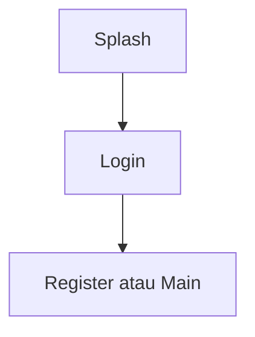

# Autentikasi — Personal Feature Documentation
## 0. Metadata
| Field | Detail |
| --- | --- |
| **Nama Fitur** | Autentikasi |
| **Status** | `Implemented` |
| **Versi Dokumen** | v1.0 |
| **Tanggal Dibuat / Update** | 2026-08-27 |
| **Android Module / Flavor** | `:app`; `demo`, `production` |
| **Source Scope** | Login dan registrasi email/password |
| **Last Verified Against Commit** | `5b3dd1af81698b0e47de8db598d5cba694907a65` |
| **Confidence Summary** | Verified |
## 1. Ringkasan dan Tujuan
Pengguna dapat login atau mendaftar dengan email/password. Production memakai Supabase; demo memakai repository in-memory.
**Tujuan utama**: membuat sesi pengguna dan masuk ke `Main`.
**Di luar cakupan**: OAuth, reset password, dan verifikasi email UI: N/A.
## 2. Entry Point dan User Flow
**Entry point**: `Splash` menuju `Login`; `LoginScreen` membuka `RegisterScreen`.

1. Isi kredensial dan tekan aksi masuk/daftar.
2. ViewModel memvalidasi dan memanggil `AuthRepository`.
3. Sukses mereset back stack ke `Main`.
## 3. UI/UX dan Interaksi
| Screen / Composable | Perilaku aktual | Evidence |
| --- | --- | --- |
| `LoginScreen` | Form email/password dan snackbar error | `presentation/ui/auth/LoginScreen.kt` |
| `RegisterScreen` | Form nama, email, password, konfirmasi, tanggal lahir | `presentation/ui/auth/RegisterScreen.kt` |
**State UI**: loading dan error berasal dari `LoginState`/`RegisterState`; empty: N/A. Accessibility/adaptive UI: TODO/VERIFY.
## 4. Implementasi Teknis
| Peran | File / Symbol | Evidence |
| --- | --- | --- |
| State | `LoginViewModel`, `RegisterViewModel` | `presentation/ui/auth/` |
| Data | `AuthRepository`, `AuthRepositoryImpl` | `domain/repository/`, `data/repository/` |
| Navigation | `Login`, `Register`, `resetTo(Main)` | `presentation/navigation/NavGraph.kt:78-94` |
| DI | flavor `AppModule` | `src/demo/`, `src/production/` |
**State dan Data Flow**: Screen -> ViewModel -> `AuthRepository` -> demo memory atau Supabase -> state UI.
**Storage, API, dan Dependency**: production memakai Supabase Auth/PostgREST/Storage; dependency `supabase-auth`; demo tidak persisten.
## 5. Aturan Bisnis, Validasi, dan Edge Cases
| Skenario | Perilaku aktual / diharapkan | Evidence | Confidence |
| --- | --- | --- | --- |
| Login invalid | Email wajib/format valid; password wajib, minimum 6 | `LoginViewModel.kt:50-68` | Verified |
| Register invalid | Nama, email valid, password min. 6, konfirmasi sama, tanggal lahir wajib | `RegisterViewModel.kt:75-120` | Verified |
| Error API | Dipetakan ke snackbar/resource pada login | `LoginViewModel.kt:84-105` | Verified |
## 6. Android Platform, Security, dan Privacy
| Area | Detail | Evidence | Status |
| --- | --- | --- | --- |
| Data sensitif | Password dikirim ke Supabase Auth; penyimpanan sesi kustom tidak ditemukan | `AuthRepositoryImpl.kt` | Partial |
| Manifest | `INTERNET` | `AndroidManifest.xml:5` | Verified |
## 7. Testing dan Manual QA
**Existing Tests**: `src/testDemo/.../DemoRepositoriesTest.kt`, unit demo repository; tidak ada test UI/VM production.
### Manual QA Checklist
- [ ] Login valid dan invalid.
- [ ] Registrasi valid dan setiap validasi form.
- [ ] Back stack setelah sukses menuju `Main`.
## 8. Performance dan Reliability
| Area | Implementasi aktual / risiko | Evidence | Tindakan lanjut |
| --- | --- | --- | --- |
| Session | Registrasi mengharapkan user aktif sesudah `signUpWith` | `AuthRepositoryImpl.kt:60-70` | TODO/VERIFY konfigurasi email confirmation |
## 9. Dependency, Risiko, dan TODO
**Bergantung pada**: Hilt, Navigation 3, Supabase pada production.
| Risiko / Pertanyaan / TODO | Evidence / Source | Status |
| --- | --- | --- |
| Error register hard-coded Inggris | `RegisterViewModel.kt` | Open |
## 10. Changelog
| Versi | Tanggal | Perubahan | Commit |
| --- | --- | --- | --- |
| v1.0 | 2026-08-27 | Dokumen awal dibuat | `5b3dd1a` |
## 11. Referensi
- Source code: `presentation/ui/auth/`, `domain/repository/AuthRepository.kt`.
- Design / screenshot: N/A.
- External API documentation: N/A.
- Existing documentation: `docs/features/imfit-features.md`.
## 12. Evidence Map
| Claim | Source | Evidence Type | Confidence |
| --- | --- | --- | --- |
| Sukses auth mereset ke Main | `NavGraph.kt:78-94` | code | Verified |
## 13. Coverage Map
| Area | Files Inspected | Coverage | Notes |
| --- | ---: | --- | --- |
| UI / Compose | 2 | Verified | Login, register |
| State / ViewModel | 2 | Verified | Validasi dan state |
| Data / storage / API | 3 | Verified | Repository per flavor |
| Navigation / DI | 2 | Verified | NavGraph, modules |
| Android platform | 1 | Partial | Internet |
| Tests | 1 | Partial | Demo saja |
