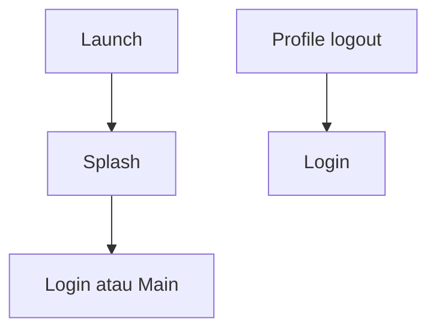

# Sesi Login dan Logout — Personal Feature Documentation
## 0. Metadata
| Field | Detail |
| --- | --- |
| **Nama Fitur** | Sesi login dan logout |
| **Status** | `Implemented` |
| **Versi Dokumen** | v1.0 |
| **Tanggal Dibuat / Update** | 2026-08-27 |
| **Android Module / Flavor** | `:app`; demo, production |
| **Source Scope** | Splash, status sesi, logout profil |
| **Last Verified Against Commit** | `5b3dd1af81698b0e47de8db598d5cba694907a65` |
| **Confidence Summary** | Verified |
## 1. Ringkasan dan Tujuan
Splash memilih `Login` atau `Main` dari status repository. Logout tersedia di profil dan mengembalikan stack ke `Login`.
**Tujuan utama**: mengarahkan pengguna sesuai sesi aktif.
**Di luar cakupan**: pemulihan sesi offline terpisah: N/A.
## 2. Entry Point dan User Flow
**Entry point**: `SplashScreen`; tombol logout `ProfileScreen`.

1. Splash menunggu sekitar 1,8 detik lalu memeriksa sesi.
2. Login aktif menuju `Main`; selain itu menuju `Login`.
3. Logout membatalkan sync, sign-out, menghapus cache, lalu navigasi ke login.
## 3. UI/UX dan Interaksi
| Screen / Composable | Perilaku aktual | Evidence |
| --- | --- | --- |
| `SplashScreen` | Tampilan awal dan callback tujuan | `presentation/ui/splash/SplashScreen.kt:117-156` |
| `ProfileScreen` | Memicu logout | `presentation/ui/profile/ProfileScreen.kt:199-205` |
**State UI**: splash; error/empty terpisah: N/A. Accessibility/adaptive UI: TODO/VERIFY.
## 4. Implementasi Teknis
| Peran | File / Symbol | Evidence |
| --- | --- | --- |
| State | `SplashViewModel.isLoggedIn`, `ProgressViewModel.logout` | `presentation/ui/` |
| Data | `AuthRepository.isLoggedIn/logout` | `domain/repository/AuthRepository.kt` |
| Navigation | `resetTo(Login/Main)` | `NavGraph.kt:71-75,197-205` |
| Runtime | Sync cancellation saat logout | `AuthRepositoryImpl.kt:258-266` |
**State dan Data Flow**: Splash/Profile -> ViewModel -> AuthRepository -> Supabase/cache atau demo memory.
**Storage, API, dan Dependency**: Supabase Auth production; demo sesi hanya in-memory.
## 5. Aturan Bisnis, Validasi, dan Edge Cases
| Skenario | Perilaku aktual / diharapkan | Evidence | Confidence |
| --- | --- | --- | --- |
| App start | `currentUserOrNull()` menentukan sesi production | `AuthRepositoryImpl.kt:303-313` | Verified |
| Logout error | Exception ditelan dan UI tetap ke Login | `AuthRepositoryImpl.kt:258-265` | Verified |
## 6. Android Platform, Security, dan Privacy
| Area | Detail | Evidence | Status |
| --- | --- | --- | --- |
| Session | Supabase Auth PKCE memakai `imfit://login-callback` | `SupabaseModule.kt:27-30` | Verified |
| Manifest | Intent-filter callback tidak ditemukan | `AndroidManifest.xml` | TODO/VERIFY |
## 7. Testing dan Manual QA
**Existing Tests**: `DemoRepositoriesTest.kt` mencakup status demo login/logout; tidak ada test sesi production.
### Manual QA Checklist
- [ ] Launch dengan dan tanpa sesi.
- [ ] Logout lalu relaunch aplikasi.
- [ ] Pastikan back tidak kembali ke profil setelah logout.
## 8. Performance dan Reliability
| Area | Implementasi aktual / risiko | Evidence | Tindakan lanjut |
| --- | --- | --- | --- |
| Startup | `SplashViewModel` memakai `runBlocking` | `SplashViewModel.kt:13-22` | Open |
## 9. Dependency, Risiko, dan TODO
**Bergantung pada**: Supabase Auth, sync scheduler production.
| Risiko / Pertanyaan / TODO | Evidence / Source | Status |
| --- | --- | --- |
| Sign-out gagal tetap mengubah UI | `AuthRepositoryImpl.kt` | Open |
## 10. Changelog
| Versi | Tanggal | Perubahan | Commit |
| --- | --- | --- | --- |
| v1.0 | 2026-08-27 | Dokumen awal dibuat | `5b3dd1a` |
## 11. Referensi
- Source code: `presentation/ui/splash/`, `presentation/ui/profile/`.
- Design / screenshot: N/A.
- External API documentation: N/A.
- Existing documentation: `docs/features/imfit-features.md`.
## 12. Evidence Map
| Claim | Source | Evidence Type | Confidence |
| --- | --- | --- | --- |
| Splash mereset tujuan auth | `NavGraph.kt:71-75` | code | Verified |
## 13. Coverage Map
| Area | Files Inspected | Coverage | Notes |
| --- | ---: | --- | --- |
| UI / Compose | 2 | Verified | Splash, profile |
| State / ViewModel | 2 | Verified | Cek dan logout |
| Data / storage / API | 1 | Verified | Auth repository |
| Navigation / DI | 1 | Verified | NavGraph |
| Android platform | 2 | Partial | PKCE callback |
| Tests | 1 | Partial | Demo saja |
