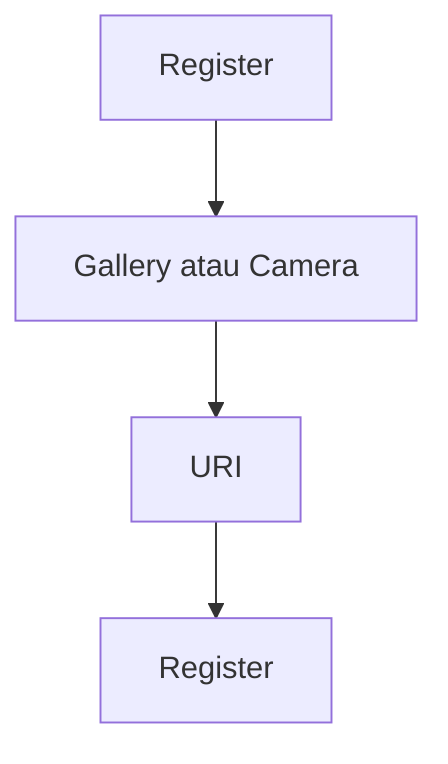

# Foto Profil Saat Registrasi — Personal Feature Documentation
## 0. Metadata
| Field | Detail |
| --- | --- |
| **Nama Fitur** | Foto profil saat registrasi |
| **Status** | `Implemented` |
| **Versi Dokumen** | v1.0 |
| **Tanggal Dibuat / Update** | 2026-08-27 |
| **Android Module / Flavor** | `:app`; demo, production |
| **Source Scope** | Pemilih galeri, kamera, avatar |
| **Last Verified Against Commit** | `5b3dd1af81698b0e47de8db598d5cba694907a65` |
| **Confidence Summary** | Verified |
## 1. Ringkasan dan Tujuan
Form registrasi dapat memilih gambar galeri atau mengambil foto kamera. Production mengunggah avatar ke Supabase Storage; demo mempertahankan URI lokal.
**Tujuan utama**: melampirkan avatar opsional ketika akun dibuat.
**Di luar cakupan**: edit avatar dari profil: tidak terhubung.
## 2. Entry Point dan User Flow
**Entry point**: kontrol foto pada `RegisterScreen`.

1. Pengguna memilih gallery atau kamera.
2. URI disimpan pada `RegisterState.profilePhotoUri`.
3. Production upload setelah account dibuat; UI avatar memakai signed URL.
## 3. UI/UX dan Interaksi
| Screen / Composable | Perilaku aktual | Evidence |
| --- | --- | --- |
| `RegisterScreen` | `GetContent("image/*")`, `TakePicture`, permission camera | `RegisterScreen.kt:101-135,180-220` |
| `IMFITProfilePhoto` | Render URI/URL dengan fallback | `components/common/IMFITProfilePhoto.kt` |
**State UI**: URI terpilih; kegagalan kamera/upload tidak memiliki pesan UI terverifikasi. Accessibility/adaptive UI: TODO/VERIFY.
## 4. Implementasi Teknis
| Peran | File / Symbol | Evidence |
| --- | --- | --- |
| State | `RegisterState.profilePhotoUri` | `RegisterViewModel.kt` |
| Data | upload `avatars`, `ProfileDto` | `AuthRepositoryImpl.kt:74-180`, `ProfileDto.kt` |
| Platform | `FileProvider` cache JPG | `AndroidManifest.xml:43-51`, `res/xml/file_paths.xml` |
| Dependency | Coil | `app/build.gradle.kts:116-118` |
**State dan Data Flow**: launcher -> URI -> register VM -> production Supabase Storage/profiles -> signed avatar URL.
**Navigation**: N/A; tetap bagian registrasi.
## 5. Aturan Bisnis, Validasi, dan Edge Cases
| Skenario | Perilaku aktual / diharapkan | Evidence | Confidence |
| --- | --- | --- | --- |
| Camera denied/fails | Tidak ada pesan UI ditemukan | `RegisterScreen.kt` | Partial |
| Upload gagal | Dicatat, registrasi tetap sukses tanpa avatar | `AuthRepositoryImpl.kt:76-83` | Verified |
| File besar/non-image | Tidak ada limit/kompresi/validasi MIME nyata | `AuthRepositoryImpl.kt` | Verified |
## 6. Android Platform, Security, dan Privacy
| Area | Detail | Evidence | Status |
| --- | --- | --- | --- |
| Permission | `CAMERA`; media read dideklarasikan | `AndroidManifest.xml:12-20` | Verified |
| Storage | Production avatar path private dan signed URL satu jam | `AuthRepositoryImpl.kt:74-180` | Verified |
| Privacy | Isi URI dibaca penuh ke memori saat upload | `AuthRepositoryImpl.kt` | Verified |
## 7. Testing dan Manual QA
**Existing Tests**: tidak ditemukan test picker, permission, upload, atau Coil avatar.
### Manual QA Checklist
- [ ] Pilih gallery dan foto kamera pada perangkat API berbeda.
- [ ] Tolak permission kamera dan cek recovery.
- [ ] Daftar dengan dan tanpa foto; cek avatar production.
## 8. Performance dan Reliability
| Area | Implementasi aktual / risiko | Evidence | Tindakan lanjut |
| --- | --- | --- | --- |
| Upload | Seluruh file dibaca ke memori | `AuthRepositoryImpl.kt` | Open |
## 9. Dependency, Risiko, dan TODO
**Bergantung pada**: Activity Result API, FileProvider, Coil, Supabase Storage production.
| Risiko / Pertanyaan / TODO | Evidence / Source | Status |
| --- | --- | --- |
| Tidak ada pembatasan file dan feedback failure | `RegisterScreen.kt`, `AuthRepositoryImpl.kt` | Open |
## 10. Changelog
| Versi | Tanggal | Perubahan | Commit |
| --- | --- | --- | --- |
| v1.0 | 2026-08-27 | Dokumen awal dibuat | `5b3dd1a` |
## 11. Referensi
- Source code: `RegisterScreen.kt`, `AuthRepositoryImpl.kt`, `IMFITProfilePhoto.kt`.
- Design / screenshot: N/A.
- External API documentation: N/A.
- Existing documentation: `docs/features/imfit-features.md`.
## 12. Evidence Map
| Claim | Source | Evidence Type | Confidence |
| --- | --- | --- | --- |
| Kamera memakai FileProvider | `RegisterScreen.kt:119-134`, `AndroidManifest.xml:43-51` | code/manifest | Verified |
## 13. Coverage Map
| Area | Files Inspected | Coverage | Notes |
| --- | ---: | --- | --- |
| UI / Compose | 2 | Verified | Register, avatar |
| State / ViewModel | 1 | Verified | URI state |
| Data / storage / API | 2 | Verified | Upload/sign URL |
| Navigation / DI | 0 | N/A | Tidak ada rute |
| Android platform | 2 | Verified | Permission/provider |
| Tests | 0 | N/A | Tidak ditemukan |
