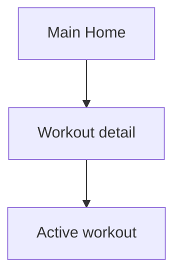

# Dashboard Workout — Personal Feature Documentation
## 0. Metadata
| Field | Detail |
|---|---|
| **Nama Fitur** | Dashboard workout |
| **Status** | `Implemented` |
| **Versi Dokumen** | v1.0 |
| **Tanggal Dibuat / Update** | 2026-08-27 |
| **Android Module / Flavor** | `:app`; demo, production |
| **Source Scope** | Home tab workout |
| **Last Verified Against Commit** | `5b3dd1af81698b0e47de8db598d5cba694907a65` |
| **Confidence Summary** | Verified |
## 1. Ringkasan dan Tujuan
`HomeScreen` menampilkan sapaan, workout terakhir, template, indikator sync, dan kartu sesi aktif. Dashboard membuka detail atau sesi aktif.
**Tujuan utama**: titik masuk pengelolaan dan pelaksanaan workout.
**Di luar cakupan**: analytics/remote config: N/A.
## 2. Entry Point dan User Flow
**Entry point**: `MainScreen` tab Home.

1. `HomeViewModel` memuat user, template, log, dan sesi.
2. Pengguna membuka detail/template aktif atau membuat template inline.
3. Navigasi memakai `WorkoutDetail` atau `ActiveWorkout`.
## 3. UI/UX dan Interaksi
| Screen / Composable | Perilaku aktual | Evidence |
|---|---|---|
| `HomeScreen` | Shimmer, greeting, last workout, template/empty, sync | `presentation/ui/home/HomeScreen.kt:86` |
| dialog create | Konfirmasi hanya jika nama tidak blank | `HomeScreen.kt:120-157` |
**State UI**: loading shimmer; content template/kartu empty; error repository menjadi dashboard kosong. Accessibility/adaptive UI: TODO/VERIFY.
## 4. Implementasi Teknis
| Peran | File / Symbol | Evidence |
|---|---|---|
| UI/state | `HomeScreen`, `HomeViewModel` | `presentation/ui/home/` |
| Data | `WorkoutRepositoryImpl` | `data/repository/WorkoutRepositoryImpl.kt` |
| Navigation | `Main`, `WorkoutDetail`, `ActiveWorkout` | `NavGraph.kt:96-135` |
| DI | production Room repository/demo memory | flavor `AppModule.kt` |
**State dan Data Flow**: Home -> `HomeViewModel` -> `WorkoutRepository` -> Room/demo -> UI state.
**Storage, API, dan Dependency**: Room local-first production; sync indikator memakai state provider.
## 5. Aturan Bisnis, Validasi, dan Edge Cases
| Skenario | Perilaku aktual / diharapkan | Evidence | Confidence |
|---|---|---|---|
| Nama kosong | Tidak dapat konfirmasi dialog | `HomeScreen.kt:120-157` | Verified |
| Load gagal | Tampak seperti dashboard kosong | `HomeViewModel.kt:86-96` | Verified |
## 6. Android Platform, Security, dan Privacy
| Area | Detail | Evidence | Status |
|---|---|---|---|
| Platform/security | Tidak ada integrasi khusus pada dashboard | `HomeScreen.kt` | N/A |
## 7. Testing dan Manual QA
**Existing Tests**: `DemoRepositoriesTest.kt` dan `WorkoutRepositoryRoomFirstTest.kt` menguji lifecycle repository, bukan UI.
### Manual QA Checklist
- [ ] Muat dashboard tanpa/berisi template dan log.
- [ ] Buat template inline, buka detail, dan buka sesi aktif.
- [ ] Cek offline/sync indicator pada production.
## 8. Performance dan Reliability
| Area | Implementasi aktual / risiko | Evidence | Tindakan lanjut |
|---|---|---|---|
| Error | Error load tidak dibedakan dari empty | `HomeViewModel.kt` | Open |
## 9. Dependency, Risiko, dan TODO
**Bergantung pada**: Compose, Room/demo repository, sync state.
| Risiko / Pertanyaan / TODO | Evidence / Source | Status |
|---|---|---|
| Template kosong dapat dibuat | `HomeViewModel.kt:111-132` | Open |
## 10. Changelog
|Versi|Tanggal|Perubahan|Commit|
|---|---|---|---|
|v1.0|2026-08-27|Dokumen awal dibuat|`5b3dd1a`|
## 11. Referensi
- Source code: `presentation/ui/home/`, `WorkoutRepositoryImpl.kt`.
- Design / screenshot: N/A.
- External API documentation: N/A.
- Existing documentation: `docs/features/imfit-features.md`.
## 12. Evidence Map
|Claim|Source|Evidence Type|Confidence|
|---|---|---|---|
|Home membuka detail atau sesi|`NavGraph.kt:96-135`|code|Verified|
## 13. Coverage Map
|Area|Files Inspected|Coverage|Notes|
|---|---:|---|---|
|UI / Compose|1|Verified|Home|
|State / ViewModel|1|Verified|Load/create|
|Data / storage / API|1|Verified|Repository|
|Navigation / DI|2|Verified|Routes/flavors|
|Android platform|0|N/A|Tidak ada khusus|
|Tests|2|Partial|Repository|
