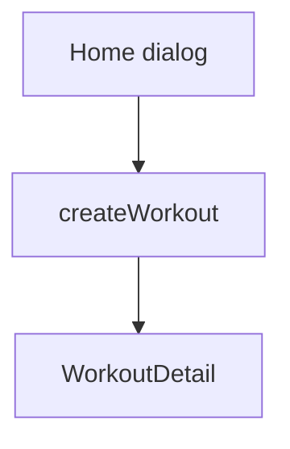

# Membuat Template Workout — Personal Feature Documentation
## 0. Metadata
|Field|Detail|
|---|---|
|**Nama Fitur**|Membuat template workout|
|**Status**|`Partial`|
|**Versi Dokumen**|v1.0|
|**Tanggal Dibuat / Update**|2026-08-27|
|**Android Module / Flavor**|`:app`; demo, production|
|**Source Scope**|Create template screen dan create inline Home|
|**Last Verified Against Commit**|`5b3dd1af81698b0e47de8db598d5cba694907a65`|
|**Confidence Summary**|Verified|
## 1. Ringkasan dan Tujuan
Home dapat membuat template kosong lewat dialog. `CreateTemplateScreen` juga menyediakan nama dan exercise, namun tidak terdaftar di `NavGraph` sehingga bukan alur aktif.
**Tujuan utama**: menyimpan template baru.
**Di luar cakupan**: rute create screen aktif: TODO/VERIFY.
## 2. Entry Point dan User Flow
**Entry point**: dialog `HomeScreen`; `CreateTemplateScreen` tidak memiliki `NavKey`/call site.

1. Isi nama tidak blank di Home.
2. `HomeViewModel.createWorkout` menyimpan template tanpa exercise.
3. ID baru membuka detail.
## 3. UI/UX dan Interaksi
|Screen / Composable|Perilaku aktual|Evidence|
|---|---|---|
|`HomeScreen`|Dialog nama, create aktif bila nonblank|`HomeScreen.kt:120-157`|
|`CreateTemplateScreen`|Nama, daftar selected exercise, save|`presentation/ui/template/CreateTemplateScreen.kt`|
**State UI**: screen terpisah memiliki empty selection dan error nama; screen tidak reachable. Accessibility/adaptive UI: TODO/VERIFY.
## 4. Implementasi Teknis
|Peran|File / Symbol|Evidence|
|---|---|---|
|State|`HomeViewModel`, `CreateTemplateViewModel`|`presentation/ui/home/`, `ui/template/`|
|Data|`WorkoutRepository.createTemplate`|`WorkoutRepositoryImpl.kt:132-177`|
|Navigation|`WorkoutDetail`; tidak ada `CreateTemplate` route|`NavGraph.kt`|
|DI|Hilt repositories|flavor `AppModule.kt`|
**State dan Data Flow**: UI -> ViewModel -> `WorkoutRepository` -> Room transaction/sync queue atau demo memory.
**Storage, API, dan Dependency**: production UUID/timestamps/pending CREATE dalam Room, lalu enqueue sync.
## 5. Aturan Bisnis, Validasi, dan Edge Cases
|Skenario|Perilaku aktual / diharapkan|Evidence|Confidence|
|---|---|---|---|
|Home nama blank|Aksi dialog disabled|`HomeScreen.kt`|Verified|
|Dedicated screen blank|`"Template name is required"`|`CreateTemplateViewModel.kt:75-105`|Verified|
|Tanpa exercise|Home mengizinkan; dedicated VM return tanpa simpan|`HomeViewModel.kt`, `CreateTemplateViewModel.kt`|Verified|
## 6. Android Platform, Security, dan Privacy
|Area|Detail|Evidence|Status|
|---|---|---|---|
|Platform/security|Tidak ada integrasi khusus|source scope|N/A|
## 7. Testing dan Manual QA
**Existing Tests**: demo create lifecycle dan Room pending-create test; tidak ada VM/UI/navigation test dedicated screen.
### Manual QA Checklist
- [ ] Buat dari Home dengan nama valid/blank.
- [ ] Pastikan detail template baru terbuka.
- [ ] TODO/VERIFY rute `CreateTemplateScreen` sebelum mengandalkannya.
## 8. Performance dan Reliability
|Area|Implementasi aktual / risiko|Evidence|Tindakan lanjut|
|---|---|---|---|
|Reachability|Dedicated create flow dead code|`NavGraph.kt`, `Routes.kt`|Open|
## 9. Dependency, Risiko, dan TODO
**Bergantung pada**: `WorkoutRepository`, Room/sync production.
|Risiko / Pertanyaan / TODO|Evidence / Source|Status|
|---|---|---|
|`selected_exercise_ids` tidak ditulis navigation aktif|`CreateTemplateViewModel.kt`, `NavGraph.kt`|Open|
## 10. Changelog
|Versi|Tanggal|Perubahan|Commit|
|---|---|---|---|
|v1.0|2026-08-27|Dokumen awal dibuat|`5b3dd1a`|
## 11. Referensi
- Source code: `HomeViewModel.kt`, `presentation/ui/template/`.
- Design / screenshot: N/A.
- External API documentation: N/A.
- Existing documentation: `docs/features/imfit-features.md`.
## 12. Evidence Map
|Claim|Source|Evidence Type|Confidence|
|---|---|---|---|
|Tidak ada destination create dedicated|`NavGraph.kt`|code|Verified|
## 13. Coverage Map
|Area|Files Inspected|Coverage|Notes|
|---|---:|---|---|
|UI / Compose|2|Verified|Inline dan dedicated|
|State / ViewModel|2|Verified|Create state|
|Data / storage / API|1|Verified|Create transaction|
|Navigation / DI|2|Verified|Route absence|
|Android platform|0|N/A|Tidak ada khusus|
|Tests|2|Partial|Repository saja|
