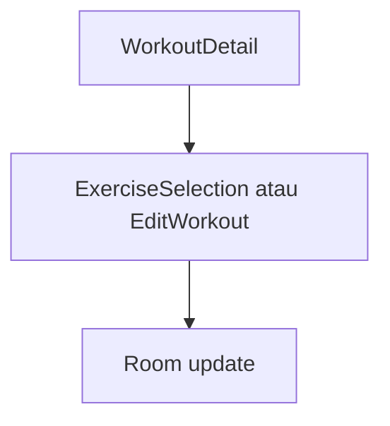

# Mengelola Template Workout — Personal Feature Documentation
## 0. Metadata
|Field|Detail|
|---|---|
|**Nama Fitur**|Mengelola template workout|
|**Status**|`Implemented`|
|**Versi Dokumen**|v1.0|
|**Tanggal Dibuat / Update**|2026-08-27|
|**Android Module / Flavor**|`:app`; demo, production|
|**Source Scope**|Detail/edit template|
|**Last Verified Against Commit**|`5b3dd1af81698b0e47de8db598d5cba694907a65`|
|**Confidence Summary**|Verified|
## 1. Ringkasan dan Tujuan
Detail template dapat tambah/hapus exercise, konfigurasi set/reps/rest, edit nama, dan hapus template. Perubahan production local-first dan diantrikan sync.
**Tujuan utama**: mengatur isi template sebelum workout.
**Di luar cakupan**: template sharing: N/A.
## 2. Entry Point dan User Flow
**Entry point**: kartu template Home -> `WorkoutDetail(workoutId)`.

1. Buka detail lalu tambah/hapus/edit.
2. Selector mengembalikan ID exercise; edit menyimpan template lengkap.
3. Detail dapat mulai sesi bila tidak ada sesi aktif.
## 3. UI/UX dan Interaksi
|Screen / Composable|Perilaku aktual|Evidence|
|---|---|---|
|`WorkoutDetailScreen`|Shimmer, empty, add/start/edit/delete, swipe confirmation|`presentation/ui/workout/WorkoutDetailScreen.kt`|
|`EditWorkoutScreen`|Nama, remove, set/reps/rest, add/remove set, save|`EditWorkoutScreen.kt`|
**State UI**: loading shimmer; empty exercise; sesi aktif memblokir edit/delete/start. Accessibility/adaptive UI: TODO/VERIFY.
## 4. Implementasi Teknis
|Peran|File / Symbol|Evidence|
|---|---|---|
|State|`WorkoutDetailViewModel`, `EditWorkoutViewModel`|`presentation/ui/workout/`|
|Data|`updateTemplate`, `deleteTemplate`|`WorkoutRepositoryImpl.kt:179-274`|
|Navigation|`WorkoutDetail`, `ExerciseSelection`, `EditWorkout`|`NavGraph.kt:119-143`|
|Storage|template/exercise rows transaction|`TemplateExerciseEntity.kt`|
**State dan Data Flow**: screen -> VM -> repository -> Room transaction/sync queue -> state.
**Storage, API, dan Dependency**: composite template/exercise key; delete soft-delete dan queue DELETE.
## 5. Aturan Bisnis, Validasi, dan Edge Cases
|Skenario|Perilaku aktual / diharapkan|Evidence|Confidence|
|---|---|---|---|
|Exercise duplicate|Detail dan repository menolak|`WorkoutRepositoryImpl.kt:638-642`|Verified|
|Set/reps/rest invalid|Dialog default 3/8/60; clamp >=1/>=1/>=0|`WorkoutDetailScreen.kt:447-498`|Verified|
|Edit save|Nama nonblank; template kosong tetap valid|`EditWorkoutScreen.kt:219-225`|Verified|
|ID tidak ada|Edit VM dapat tetap loading|`EditWorkoutViewModel.kt:49-58`|Verified|
## 6. Android Platform, Security, dan Privacy
|Area|Detail|Evidence|Status|
|---|---|---|---|
|Platform/security|Tidak ada integrasi khusus|source scope|N/A|
## 7. Testing dan Manual QA
**Existing Tests**: Room test create-then-edit pending CREATE; tidak ada UI/VM test.
### Manual QA Checklist
- [ ] Tambah duplicate dan hapus exercise dengan konfirmasi.
- [ ] Ubah semua parameter set dan simpan nama blank/valid.
- [ ] Cek blokir perubahan saat sesi aktif dan delete sync.
## 8. Performance dan Reliability
|Area|Implementasi aktual / risiko|Evidence|Tindakan lanjut|
|---|---|---|---|
|Save|UI sukses meski `updateTemplate()` null|`EditWorkoutViewModel.kt:138-143`|Open|
## 9. Dependency, Risiko, dan TODO
**Bergantung pada**: Navigation 3, `WorkoutRepository`, Room/sync.
|Risiko / Pertanyaan / TODO|Evidence / Source|Status|
|---|---|---|
|Tidak ada test UI/VM|source test inventory|Open|
## 10. Changelog
|Versi|Tanggal|Perubahan|Commit|
|---|---|---|---|
|v1.0|2026-08-27|Dokumen awal dibuat|`5b3dd1a`|
## 11. Referensi
- Source code: `WorkoutDetailScreen.kt`, `EditWorkoutScreen.kt`, `WorkoutRepositoryImpl.kt`.
- Design / screenshot: N/A.
- External API documentation: N/A.
- Existing documentation: `docs/features/imfit-features.md`.
## 12. Evidence Map
|Claim|Source|Evidence Type|Confidence|
|---|---|---|---|
|Delete soft-delete dan queue sync|`WorkoutRepositoryImpl.kt:179-274`|code|Verified|
## 13. Coverage Map
|Area|Files Inspected|Coverage|Notes|
|---|---:|---|---|
|UI / Compose|2|Verified|Detail/edit|
|State / ViewModel|2|Verified|Template state|
|Data / storage / API|2|Verified|Room entities/repo|
|Navigation / DI|2|Verified|NavGraph/flavor DI|
|Android platform|0|N/A|Tidak ada khusus|
|Tests|1|Partial|Repository|
