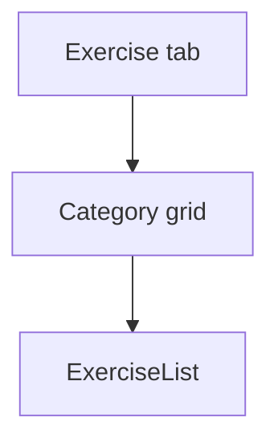

# Perpustakaan Exercise — Personal Feature Documentation
## 0. Metadata
|Field|Detail|
|---|---|
|**Nama Fitur**|Perpustakaan exercise|
|**Status**|`Implemented`|
|**Versi Dokumen**|v1.0|
|**Tanggal Dibuat / Update**|2026-08-27|
|**Android Module / Flavor**|`:app`; demo, production|
|**Source Scope**|Browser kategori dan list exercise|
|**Last Verified Against Commit**|`5b3dd1af81698b0e47de8db598d5cba694907a65`|
|**Confidence Summary**|Verified|
## 1. Ringkasan dan Tujuan
Tab Exercise menampilkan grid `MuscleCategory`, lalu daftar nama/deskripsi exercise pada kategori terpilih.
**Tujuan utama**: menelusuri exercise dasar berdasarkan otot.
**Di luar cakupan**: detail exercise khusus: N/A.
## 2. Entry Point dan User Flow
**Entry point**: tab Exercise `MainScreen`.

1. Pilih kategori dari grid tiga kolom.
2. `ExerciseList(categoryName)` dimuat.
3. Tampilkan shimmer, empty, atau kartu exercise.
## 3. UI/UX dan Interaksi
|Screen / Composable|Perilaku aktual|Evidence|
|---|---|---|
|`ExerciseBrowserScreen`|Grid `MuscleCategory.entries`|`ExerciseBrowserScreen.kt`|
|`ExerciseListScreen`|Shimmer, empty, kartu nama/deskripsi|`ExerciseListScreen.kt`|
**State UI**: loading/empty/content; route kategori tidak valid menjadi `CHEST`. Accessibility/adaptive UI: TODO/VERIFY.
## 4. Implementasi Teknis
|Peran|File / Symbol|Evidence|
|---|---|---|
|State|`ExerciseBrowserViewModel`|`ExerciseBrowserViewModel.kt`|
|Data|`ExerciseRepositoryImpl`|`data/repository/ExerciseRepositoryImpl.kt:19-72`|
|Navigation|`ExerciseList(categoryName)`|`NavGraph.kt:104-105,145-150`|
|DI|production repository/demo fake|flavor `AppModule.kt`|
**State dan Data Flow**: list -> VM -> `ExerciseRepository` -> Room active rows/fallback fake -> category map UI.
**Storage, API, dan Dependency**: Room `ExerciseDao` filters `is_active = 1`; production fallback fake on empty/error.
## 5. Aturan Bisnis, Validasi, dan Edge Cases
|Skenario|Perilaku aktual / diharapkan|Evidence|Confidence|
|---|---|---|---|
|Duplicate IDs|Dihapus saat load|`ExerciseBrowserViewModel.kt`|Verified|
|Room empty/error|Fallback `FakeExerciseDataSource`|`ExerciseRepositoryImpl.kt:19-72`|Verified|
|Kategori invalid|Diam-diam `CHEST`|`ExerciseListScreen.kt:63`|Verified|
## 6. Android Platform, Security, dan Privacy
|Area|Detail|Evidence|Status|
|---|---|---|---|
|Platform/security|Tidak ada integrasi khusus|source scope|N/A|
## 7. Testing dan Manual QA
**Existing Tests**: `DemoRepositoriesTest.kt` menguji search/category repository; UI/navigation test tidak ditemukan.
### Manual QA Checklist
- [ ] Buka tiap kategori dan cek empty/list.
- [ ] Uji kategori route invalid bila dapat dipanggil.
- [ ] Cek fallback exercise production tanpa data Room.
## 8. Performance dan Reliability
|Area|Implementasi aktual / risiko|Evidence|Tindakan lanjut|
|---|---|---|---|
|Preload|Browser VM tidak dipakai pada screen grid; load terjadi di list|`ExerciseBrowserScreen.kt`|Open|
## 9. Dependency, Risiko, dan TODO
**Bergantung pada**: Room dan fake datasource.
|Risiko / Pertanyaan / TODO|Evidence / Source|Status|
|---|---|---|
|Tidak ada test UI|test inventory|Open|
## 10. Changelog
|Versi|Tanggal|Perubahan|Commit|
|---|---|---|---|
|v1.0|2026-08-27|Dokumen awal dibuat|`5b3dd1a`|
## 11. Referensi
- Source code: `presentation/ui/exercise/`, `ExerciseRepositoryImpl.kt`.
- Design / screenshot: N/A.
- External API documentation: N/A.
- Existing documentation: `docs/features/imfit-features.md`.
## 12. Evidence Map
|Claim|Source|Evidence Type|Confidence|
|---|---|---|---|
|Room filters active exercise|`ExerciseDao.kt`|code|Verified|
## 13. Coverage Map
|Area|Files Inspected|Coverage|Notes|
|---|---:|---|---|
|UI / Compose|2|Verified|Grid/list|
|State / ViewModel|1|Verified|Kategori|
|Data / storage / API|2|Verified|Repo/DAO|
|Navigation / DI|2|Verified|Route/flavor|
|Android platform|0|N/A|Tidak ada khusus|
|Tests|1|Partial|Demo repository|
