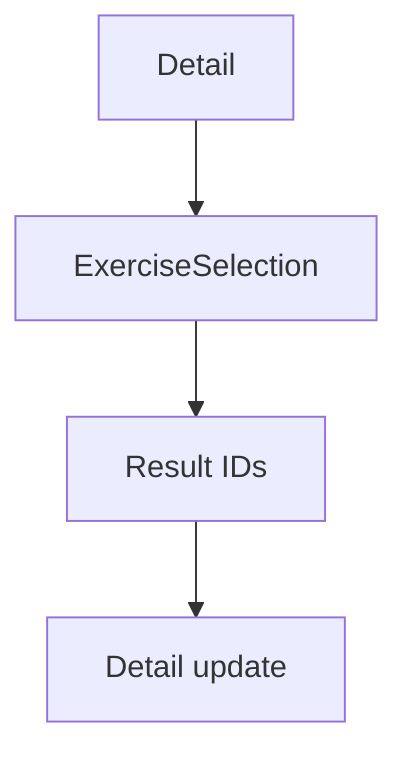

# Memilih Exercise — Personal Feature Documentation
## 0. Metadata
|Field|Detail|
|---|---|
|**Nama Fitur**|Memilih exercise|
|**Status**|`Implemented`|
|**Versi Dokumen**|v1.0|
|**Tanggal Dibuat / Update**|2026-08-27|
|**Android Module / Flavor**|`:app`; demo, production|
|**Source Scope**|Exercise selector dari template detail|
|**Last Verified Against Commit**|`5b3dd1af81698b0e47de8db598d5cba694907a65`|
|**Confidence Summary**|Verified|
## 1. Ringkasan dan Tujuan
Selector memuat semua exercise, mendukung search/filter kategori dan multi-select, lalu menambahkan hasil ke template tanpa duplikasi.
**Tujuan utama**: menambah exercise ke template.
**Di luar cakupan**: preselect exercise template dan restore selection: tidak ada.
## 2. Entry Point dan User Flow
**Entry point**: `WorkoutDetailScreen` -> `ExerciseSelection(templateId)`.

1. Filter/search dan toggle pilihan.
2. Aksi add muncul jika ada pilihan.
3. `NavGraph` mengembalikan ID lalu detail menyimpan hasil.
## 3. UI/UX dan Interaksi
|Screen / Composable|Perilaku aktual|Evidence|
|---|---|---|
|`ExerciseSelectionScreen`|Shimmer, filter, search, checkbox/card, add N|`ExerciseSelectionScreen.kt:107-127,226-241`|
**State UI**: loading/content; tidak ada pesan empty result; aksi hidden ketika zero selected. Accessibility/adaptive UI: TODO/VERIFY.
## 4. Implementasi Teknis
|Peran|File / Symbol|Evidence|
|---|---|---|
|State|`ExerciseSelectionViewModel`|`ExerciseSelectionViewModel.kt`|
|Data|`ExerciseRepository`, `updateTemplateExercises`|`WorkoutRepositoryImpl.kt`|
|Navigation|saveable `exerciseSelectionResult`|`NavGraph.kt:119-160`|
|DI|Hilt repository binding|flavor `AppModule.kt`|
**State dan Data Flow**: Selector -> VM -> exercise repo -> selected IDs -> NavGraph result -> detail -> workout repo/Room.
**Storage, API, dan Dependency**: pilihan transient; template update local-first production.
## 5. Aturan Bisnis, Validasi, dan Edge Cases
|Skenario|Perilaku aktual / diharapkan|Evidence|Confidence|
|---|---|---|---|
|Search/filter|Trim, case-insensitive name/category display name|`ExerciseSelectionViewModel.kt`|Verified|
|Duplicate|VM dan detail dedupe; repository require distinct|`WorkoutRepositoryImpl.kt:638-642`|Verified|
|Recreation|Selection tidak dipulihkan|`ExerciseSelectionScreen.kt`|Verified|
## 6. Android Platform, Security, dan Privacy
|Area|Detail|Evidence|Status|
|---|---|---|---|
|Platform/security|Tidak ada integrasi khusus|source scope|N/A|
## 7. Testing dan Manual QA
**Existing Tests**: tidak ada selector VM/UI/result-handoff test.
### Manual QA Checklist
- [ ] Search, tiap filter, multi-select, duplicate.
- [ ] Konfirmasi lalu cek exercise pada template.
- [ ] Rotate/recreate selector: TODO/VERIFY behavior.
## 8. Performance dan Reliability
|Area|Implementasi aktual / risiko|Evidence|Tindakan lanjut|
|---|---|---|---|
|State restore|`templateId` tidak dipakai; selection transient|`ExerciseSelectionScreen.kt:74`|Open|
## 9. Dependency, Risiko, dan TODO
**Bergantung pada**: Navigation 3 saveable state dan workout repository.
|Risiko / Pertanyaan / TODO|Evidence / Source|Status|
|---|---|---|
|Tidak ada empty-result state|`ExerciseSelectionScreen.kt`|Open|
## 10. Changelog
|Versi|Tanggal|Perubahan|Commit|
|---|---|---|---|
|v1.0|2026-08-27|Dokumen awal dibuat|`5b3dd1a`|
## 11. Referensi
- Source code: `ExerciseSelectionScreen.kt`, `ExerciseSelectionViewModel.kt`.
- Design / screenshot: N/A.
- External API documentation: N/A.
- Existing documentation: `docs/features/imfit-features.md`.
## 12. Evidence Map
|Claim|Source|Evidence Type|Confidence|
|---|---|---|---|
|NavGraph mengembalikan selected IDs|`NavGraph.kt:152-160`|code|Verified|
## 13. Coverage Map
|Area|Files Inspected|Coverage|Notes|
|---|---:|---|---|
|UI / Compose|1|Verified|Selector|
|State / ViewModel|1|Verified|Search/filter|
|Data / storage / API|1|Verified|Template update|
|Navigation / DI|2|Verified|Result/flavor|
|Android platform|0|N/A|Tidak ada khusus|
|Tests|0|N/A|Tidak ditemukan|
