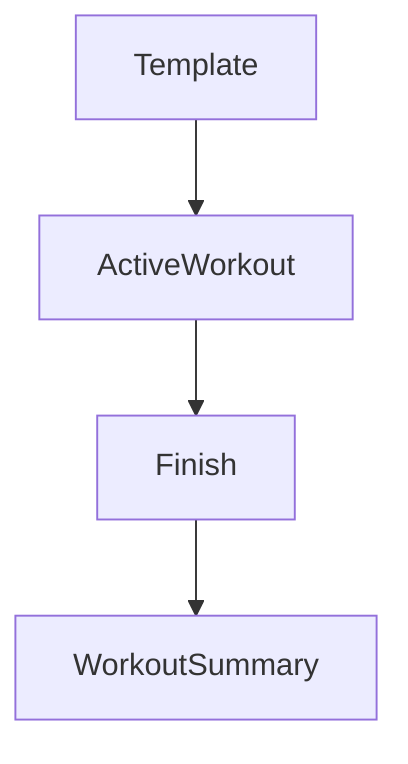

# Sesi Workout Aktif — Personal Feature Documentation
## 0. Metadata
|Field|Detail|
|---|---|
|**Nama Fitur**|Sesi workout aktif|
|**Status**|`Implemented`|
|**Versi Dokumen**|v1.0|
|**Tanggal Dibuat / Update**|2026-08-27|
|**Android Module / Flavor**|`:app`; demo, production|
|**Source Scope**|Active workout dan persistence sesi|
|**Last Verified Against Commit**|`5b3dd1af81698b0e47de8db598d5cba694907a65`|
|**Confidence Summary**|Verified|
## 1. Ringkasan dan Tujuan
Pengguna memulai/melanjutkan sesi, mengisi berat/reps, melengkapi set, pause/resume, menambah/hapus set, membatalkan atau finish. Sesi aktif disimpan Room production.
**Tujuan utama**: mencatat pelaksanaan template menjadi log.
**Di luar cakupan**: multi-workout paralel: tidak didukung UI.
## 2. Entry Point dan User Flow
**Entry point**: detail template atau kartu active Home -> `ActiveWorkout(templateId)`.

1. Restore sesi aktif bila ada, selain itu bentuk dari template.
2. Ubah set/pause dan persist sesi.
3. Finish mentransaksikan log dan menghapus sesi.
## 3. UI/UX dan Interaksi
|Screen / Composable|Perilaku aktual|Evidence|
|---|---|---|
|`ActiveWorkoutScreen`|Input kg/reps, complete/add/remove set, pause, finish|`ActiveWorkoutScreen.kt:115`|
**State UI**: set selesai mengunci input; finish aktif bila set selesai minimal satu. Accessibility/adaptive UI: TODO/VERIFY.
## 4. Implementasi Teknis
|Peran|File / Symbol|Evidence|
|---|---|---|
|State|`ActiveWorkoutViewModel.startWorkout`|`ActiveWorkoutViewModel.kt`|
|Data|`startWorkout`, `updateActiveSession`, `finishWorkout`|`WorkoutRepositoryImpl.kt:276,352,384`|
|Navigation|`ActiveWorkout` -> `WorkoutSummary`|`NavGraph.kt:163-178`|
|Storage|`ActiveSessionDao`, `active_sessions` JSON|`data/local/dao/ActiveSessionDao.kt`|
**State dan Data Flow**: screen -> active VM -> repository -> Room active session -> final logs -> summary.
**Storage, API, dan Dependency**: Room DB v6; finish queues production sync.
## 5. Aturan Bisnis, Validasi, dan Edge Cases
|Skenario|Perilaku aktual / diharapkan|Evidence|Confidence|
|---|---|---|---|
|Existing session|Dipulihkan dan templateId baru diabaikan|`ActiveWorkoutViewModel.kt:85-89`|Verified|
|Complete set|kg dan reps harus > 0|`ActiveWorkoutScreen.kt:1040,1104`|Verified|
|Finish|Minimal satu set selesai, tidak harus semua|`ActiveWorkoutScreen.kt:503`|Verified|
|Concurrent call|Repository dapat menghapus sesi lama dan membuat baru|`WorkoutRepositoryImpl.kt:276`|Verified|
## 6. Android Platform, Security, dan Privacy
|Area|Detail|Evidence|Status|
|---|---|---|---|
|Storage/session|Data session serialisasi local Room|`WorkoutRepositoryImpl.kt:352`|Verified|
## 7. Testing dan Manual QA
**Existing Tests**: `DemoRepositoriesTest.kt` mencakup start/update/finish session; tidak ada active VM/UI test.
### Manual QA Checklist
- [ ] Mulai, restore, complete, add/remove set, pause/cancel/finish.
- [ ] Cek input terkunci sesudah complete dan finish partial set.
- [ ] Cek session hilang dan summary muncul sesudah finish.
## 8. Performance dan Reliability
|Area|Implementasi aktual / risiko|Evidence|Tindakan lanjut|
|---|---|---|---|
|Concurrency|Guard dua sesi hanya UI|`WorkoutDetailScreen.kt:307`, `WorkoutRepositoryImpl.kt:276`|Open|
## 9. Dependency, Risiko, dan TODO
**Bergantung pada**: Room, serialization, workout service.
|Risiko / Pertanyaan / TODO|Evidence / Source|Status|
|---|---|---|
|Tidak ada VM/UI test|test inventory|Open|
## 10. Changelog
|Versi|Tanggal|Perubahan|Commit|
|---|---|---|---|
|v1.0|2026-08-27|Dokumen awal dibuat|`5b3dd1a`|
## 11. Referensi
- Source code: `ActiveWorkoutScreen.kt`, `ActiveWorkoutViewModel.kt`, `WorkoutRepositoryImpl.kt`.
- Design / screenshot: N/A.
- External API documentation: N/A.
- Existing documentation: `docs/features/imfit-features.md`.
## 12. Evidence Map
|Claim|Source|Evidence Type|Confidence|
|---|---|---|---|
|Finish menulis log lalu menghapus session|`WorkoutRepositoryImpl.kt:384`|code|Verified|
## 13. Coverage Map
|Area|Files Inspected|Coverage|Notes|
|---|---:|---|---|
|UI / Compose|1|Verified|Active screen|
|State / ViewModel|1|Verified|Session state|
|Data / storage / API|2|Verified|Repo/DAO|
|Navigation / DI|1|Verified|Active/summary|
|Android platform|0|N/A|Service dibahas terpisah|
|Tests|1|Partial|Demo repository|
