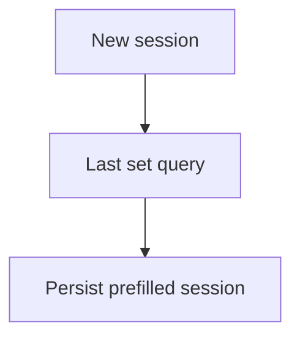

# Prefill Berat Terakhir — Personal Feature Documentation
## 0. Metadata
|Field|Detail|
|---|---|
|**Nama Fitur**|Prefill berat terakhir|
|**Status**|`Implemented`|
|**Versi Dokumen**|v1.0|
|**Tanggal Dibuat / Update**|2026-08-27|
|**Android Module / Flavor**|`:app`; demo, production|
|**Source Scope**|Inisialisasi sesi baru|
|**Last Verified Against Commit**|`5b3dd1af81698b0e47de8db598d5cba694907a65`|
|**Confidence Summary**|Verified|
## 1. Ringkasan dan Tujuan
Saat membuat sesi baru, berat set kosong diisi dari set selesai workout terakhir untuk exercise dan nomor set yang sama.
**Tujuan utama**: mengurangi input berat berulang.
**Di luar cakupan**: prefill reps/set tambahan/sesi restore: N/A.
## 2. Entry Point dan User Flow
**Entry point**: `ActiveWorkoutViewModel.startWorkout()` untuk sesi baru.

1. Bentuk sesi dari template.
2. Query berat terakhir per exercise/set.
3. Isi weight `0f` lalu simpan sesi.
## 3. UI/UX dan Interaksi
|Screen / Composable|Perilaku aktual|Evidence|
|---|---|---|
|`ActiveWorkoutScreen`|Menampilkan nilai session yang telah diprefill|`ActiveWorkoutScreen.kt`|
**State UI**: tidak ada indikator prefill khusus; loading/error terpisah N/A. Accessibility/adaptive UI: TODO/VERIFY.
## 4. Implementasi Teknis
|Peran|File / Symbol|Evidence|
|---|---|---|
|State|`prefillVolumes`|`ActiveWorkoutViewModel.kt:99`|
|Data|`getLastWeightsForExercise`|`WorkoutRepositoryImpl.kt:623`|
|Storage|`WorkoutSetDao.getLastWorkoutSetsForExercise`|`WorkoutSetDao.kt:63`|
|Navigation / DI|Bagian ActiveWorkout/Hilt repository|`NavGraph.kt`, flavor modules|
**State dan Data Flow**: new session -> VM prefill -> repository/DAO -> persisted active session -> UI.
**Storage, API, dan Dependency**: Room only; network N/A.
## 5. Aturan Bisnis, Validasi, dan Edge Cases
|Skenario|Perilaku aktual / diharapkan|Evidence|Confidence|
|---|---|---|---|
|Nilai target|Hanya weight `0f`; reps tidak diisi|`ActiveWorkoutViewModel.kt:99`|Verified|
|Riwayat|Set selesai, weight > 0, user, tidak soft-deleted|`WorkoutRepositoryImpl.kt:623`|Verified|
|Sesi lama/set tambahan|Tidak mendapat prefill|`ActiveWorkoutViewModel.kt`|Verified|
## 6. Android Platform, Security, dan Privacy
|Area|Detail|Evidence|Status|
|---|---|---|---|
|Storage|Riwayat workout lokal Room|`WorkoutSetDao.kt`|Verified|
## 7. Testing dan Manual QA
**Existing Tests**: tidak ada test DAO/VM prefill.
### Manual QA Checklist
- [ ] Finish workout dengan weight lalu mulai template sama.
- [ ] Cek nomor set dan exercise berbeda.
- [ ] Cek sesi restore tidak mengubah nilai user.
## 8. Performance dan Reliability
|Area|Implementasi aktual / risiko|Evidence|Tindakan lanjut|
|---|---|---|---|
|Ordering|Query date tidak memiliki secondary ordering|`WorkoutSetDao.kt:63`|Open|
## 9. Dependency, Risiko, dan TODO
**Bergantung pada**: Room workout logs/sets.
|Risiko / Pertanyaan / TODO|Evidence / Source|Status|
|---|---|---|
|Tidak ada test khusus|test inventory|Open|
## 10. Changelog
|Versi|Tanggal|Perubahan|Commit|
|---|---|---|---|
|v1.0|2026-08-27|Dokumen awal dibuat|`5b3dd1a`|
## 11. Referensi
- Source code: `ActiveWorkoutViewModel.kt`, `WorkoutRepositoryImpl.kt`, `WorkoutSetDao.kt`.
- Design / screenshot: N/A.
- External API documentation: N/A.
- Existing documentation: `docs/features/imfit-features.md`.
## 12. Evidence Map
|Claim|Source|Evidence Type|Confidence|
|---|---|---|---|
|Prefill terjadi hanya saat sesi baru|`ActiveWorkoutViewModel.kt:85-99`|code|Verified|
## 13. Coverage Map
|Area|Files Inspected|Coverage|Notes|
|---|---:|---|---|
|UI / Compose|1|Partial|Display via session|
|State / ViewModel|1|Verified|Prefill|
|Data / storage / API|2|Verified|Repository/DAO|
|Navigation / DI|1|Partial|Active route|
|Android platform|0|N/A|Tidak ada khusus|
|Tests|0|N/A|Tidak ditemukan|
