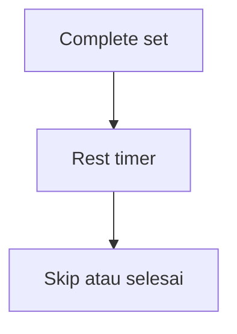

# Timer Workout dan Istirahat — Personal Feature Documentation
## 0. Metadata
|Field|Detail|
|---|---|
|**Nama Fitur**|Timer workout dan istirahat|
|**Status**|`Implemented`|
|**Versi Dokumen**|v1.0|
|**Tanggal Dibuat / Update**|2026-08-27|
|**Android Module / Flavor**|`:app`; demo, production|
|**Source Scope**|Elapsed, pause, rest timer|
|**Last Verified Against Commit**|`5b3dd1af81698b0e47de8db598d5cba694907a65`|
|**Confidence Summary**|Verified|
## 1. Ringkasan dan Tujuan
Timer workout mengecualikan pause. Menyelesaikan set memulai rest timer yang dapat skip atau diberi override untuk sesi aktif.
**Tujuan utama**: menampilkan durasi dan mengatur jeda set.
**Di luar cakupan**: restore rest timer lintas process: tidak ada.
## 2. Entry Point dan User Flow
**Entry point**: `ActiveWorkoutScreen`.

1. Counter memperbarui elapsed tiap detik.
2. Pause menolak jika rest aktif; resume akumulasi paused time.
3. Complete memulai rest override/exercise/fallback 60 detik.
## 3. UI/UX dan Interaksi
|Screen / Composable|Perilaku aktual|Evidence|
|---|---|---|
|`ActiveWorkoutScreen`|Elapsed, modal rest Skip, picker override 00:00:00-23:59:59|`ActiveWorkoutScreen.kt:344,597,799`|
**State UI**: rest modal; nilai override 0 menjadi 60. Accessibility/adaptive UI: TODO/VERIFY.
## 4. Implementasi Teknis
|Peran|File / Symbol|Evidence|
|---|---|---|
|State|`startElapsedTimeCounter`, pause/resume|`ActiveWorkoutViewModel.kt:133,335,362`|
|Runtime|`WorkoutService.startRestTimer`|`core/service/WorkoutService.kt:221`|
|Storage|session rest override|`ActiveWorkoutViewModel.setSessionRestOverride`|
|Navigation / DI|N/A; service Hilt wiring|`AndroidManifest.xml:63-67`|
**State dan Data Flow**: VM/service countdown -> screen polling -> rest dialog/notification.
**Storage, API, dan Dependency**: active session stores override; no network.
## 5. Aturan Bisnis, Validasi, dan Edge Cases
|Skenario|Perilaku aktual / diharapkan|Evidence|Confidence|
|---|---|---|---|
|Rest duration|Override, exercise rest, fallback 60|`ActiveWorkoutViewModel.kt:219`|Verified|
|Pause during rest|Ditolak|`ActiveWorkoutViewModel.kt:335`|Verified|
|Process death|Rest timer in-memory tidak pulih|`WorkoutService.kt`|Verified|
## 6. Android Platform, Security, dan Privacy
|Area|Detail|Evidence|Status|
|---|---|---|---|
|Service|Foreground workout service menjalankan rest timer|`WorkoutService.kt`|Verified|
## 7. Testing dan Manual QA
**Existing Tests**: demo repository mencakup rest override; service/timer test tidak ditemukan.
### Manual QA Checklist
- [ ] Pause/resume dan elapsed tidak menghitung pause.
- [ ] Complete set, skip rest, override 0 dan custom.
- [ ] Background/process recreation saat rest: TODO/VERIFY.
## 8. Performance dan Reliability
|Area|Implementasi aktual / risiko|Evidence|Tindakan lanjut|
|---|---|---|---|
|Duration mismatch|Summary memakai end-start dan memasukkan pause|`WorkoutLog.durationMinutes`|Open|
## 9. Dependency, Risiko, dan TODO
**Bergantung pada**: `WorkoutService`, Room active session.
|Risiko / Pertanyaan / TODO|Evidence / Source|Status|
|---|---|---|
|Kolom rest timer Room tidak dipakai|`ActiveSessionEntity.kt`|Open|
## 10. Changelog
|Versi|Tanggal|Perubahan|Commit|
|---|---|---|---|
|v1.0|2026-08-27|Dokumen awal dibuat|`5b3dd1a`|
## 11. Referensi
- Source code: `ActiveWorkoutViewModel.kt`, `ActiveWorkoutScreen.kt`, `WorkoutService.kt`.
- Design / screenshot: N/A.
- External API documentation: N/A.
- Existing documentation: `docs/features/imfit-features.md`.
## 12. Evidence Map
|Claim|Source|Evidence Type|Confidence|
|---|---|---|---|
|Workout elapsed mengecualikan pause|`ActiveWorkoutViewModel.kt:133`|code|Verified|
## 13. Coverage Map
|Area|Files Inspected|Coverage|Notes|
|---|---:|---|---|
|UI / Compose|1|Verified|Timer dialog|
|State / ViewModel|1|Verified|Elapsed/pause|
|Data / storage / API|1|Partial|Override only|
|Navigation / DI|1|Partial|Service manifest|
|Android platform|1|Verified|Service|
|Tests|1|Partial|Demo repository|
