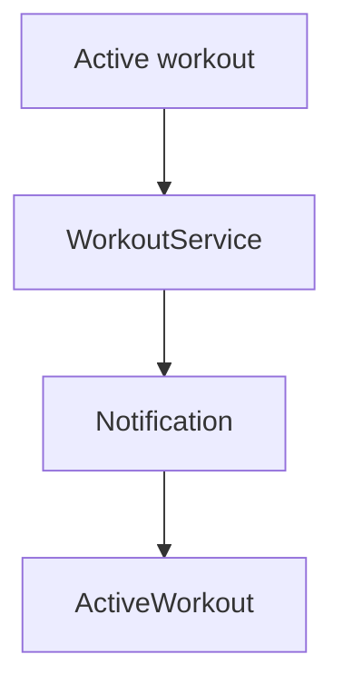

# Notifikasi Workout Aktif — Personal Feature Documentation
## 0. Metadata
|Field|Detail|
|---|---|
|**Nama Fitur**|Notifikasi workout aktif|
|**Status**|`Implemented`|
|**Versi Dokumen**|v1.0|
|**Tanggal Dibuat / Update**|2026-08-27|
|**Android Module / Flavor**|`:app`; demo, production|
|**Source Scope**|Foreground service dan notification action|
|**Last Verified Against Commit**|`5b3dd1af81698b0e47de8db598d5cba694907a65`|
|**Confidence Summary**|Verified|
## 1. Ringkasan dan Tujuan
Foreground service menampilkan waktu, progress set, volume, serta aksi stop/pause-resume/skip rest. Tap membuka sesi aktif.
**Tujuan utama**: mempertahankan status workout di notification.
**Di luar cakupan**: aksi notification ketika screen/proses tidak ada: tidak andal.
## 2. Entry Point dan User Flow
**Entry point**: sesi `ActiveWorkoutScreen`; tap notification -> `MainActivity` -> `NavGraph`.

1. VM mengirim pembaruan ke service.
2. Service refresh notification ID `1001`.
3. Intent tap menavigasi ActiveWorkout.
## 3. UI/UX dan Interaksi
|Screen / Composable|Perilaku aktual|Evidence|
|---|---|---|
|notification workout/rest|Elapsed/progress/volume atau countdown; Stop/Pause/Resume/Skip|`WorkoutNotificationManager.kt:86,135`|
**State UI**: paused/rest mengganti konten notification. Accessibility dan adaptive UI: TODO/VERIFY.
## 4. Implementasi Teknis
|Peran|File / Symbol|Evidence|
|---|---|---|
|Runtime|`WorkoutService`|`core/service/WorkoutService.kt:164`|
|Notification|`WorkoutNotificationManager`, channels|`core/notification/`, `ImFitApplication.kt`|
|Navigation|`EXTRA_OPEN_WORKOUT`, `ActiveWorkout`|`MainActivity.kt:93`, `NavGraph.kt:44-56`|
|Manifest|service and receiver|`AndroidManifest.xml:63-79`|
**State dan Data Flow**: active VM -> service -> notification/receiver -> dynamic screen receiver or activity nav.
**Storage, API, dan Dependency**: AndroidX Core notification; no network API.
## 5. Aturan Bisnis, Validasi, dan Edge Cases
|Skenario|Perilaku aktual / diharapkan|Evidence|Confidence|
|---|---|---|---|
|Android 13+|UI meminta notification permission|`ActiveWorkoutScreen.kt:127`|Verified|
|Action screen absent|Receiver hanya meneruskan broadcast ke receiver dinamis screen|`WorkoutNotificationReceiver.kt`, `ActiveWorkoutScreen.kt:214`|Verified|
## 6. Android Platform, Security, dan Privacy
|Area|Detail|Evidence|Status|
|---|---|---|---|
|Permission|`POST_NOTIFICATIONS`, foreground/dataSync, wake lock|`AndroidManifest.xml:7-10`|Verified|
|Service|`foregroundServiceType="dataSync"`|`AndroidManifest.xml:63-67`|Verified|
## 7. Testing dan Manual QA
**Existing Tests**: service, permission, notification action test tidak ditemukan.
### Manual QA Checklist
- [ ] Izinkan/tolak notification permission pada Android 13+.
- [ ] Cek semua aksi ketika screen foreground dan background.
- [ ] Tap notification membuka sesi aktif.
## 8. Performance dan Reliability
|Area|Implementasi aktual / risiko|Evidence|Tindakan lanjut|
|---|---|---|---|
|Action delivery|Tidak mengendalikan service jika screen/proses tidak aktif|receiver implementation|Open|
## 9. Dependency, Risiko, dan TODO
**Bergantung pada**: Android notifications, Hilt service.
|Risiko / Pertanyaan / TODO|Evidence / Source|Status|
|---|---|---|
|Rest channel khusus tidak dipakai|`WorkoutNotificationManager.kt`|Open|
## 10. Changelog
|Versi|Tanggal|Perubahan|Commit|
|---|---|---|---|
|v1.0|2026-08-27|Dokumen awal dibuat|`5b3dd1a`|
## 11. Referensi
- Source code: `core/service/WorkoutService.kt`, `core/notification/`.
- Design / screenshot: N/A.
- External API documentation: N/A.
- Existing documentation: `docs/features/imfit-features.md`.
## 12. Evidence Map
|Claim|Source|Evidence Type|Confidence|
|---|---|---|---|
|Tap notification menuju ActiveWorkout|`MainActivity.kt:93`, `NavGraph.kt:44-56`|code|Verified|
## 13. Coverage Map
|Area|Files Inspected|Coverage|Notes|
|---|---:|---|---|
|UI / Compose|1|Partial|Permission/receiver|
|State / ViewModel|1|Partial|Service update|
|Data / storage / API|0|N/A|Tidak ada API|
|Navigation / DI|2|Verified|Activity/service|
|Android platform|2|Verified|Manifest notification|
|Tests|0|N/A|Tidak ditemukan|
