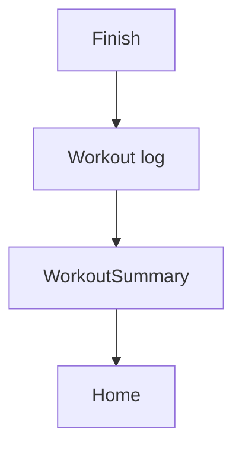

# Ringkasan Workout — Personal Feature Documentation
## 0. Metadata
|Field|Detail|
|---|---|
|**Nama Fitur**|Ringkasan workout|
|**Status**|`Implemented`|
|**Versi Dokumen**|v1.0|
|**Tanggal Dibuat / Update**|2026-08-27|
|**Android Module / Flavor**|`:app`; demo, production|
|**Source Scope**|Final log summary|
|**Last Verified Against Commit**|`5b3dd1af81698b0e47de8db598d5cba694907a65`|
|**Confidence Summary**|Verified|
## 1. Ringkasan dan Tujuan
Setelah finish, session menjadi log dan layar ringkasan memperlihatkan template, durasi, volume, exercise, dan set selesai.
**Tujuan utama**: mengonfirmasi hasil sesi.
**Di luar cakupan**: edit log dari summary: N/A.
## 2. Entry Point dan User Flow
**Entry point**: callback finish active workout -> `WorkoutSummary(workoutLogId)`.

1. Repository menulis log dalam transaction.
2. NavGraph trim ke Main lalu membuka summary.
3. Summary load log berdasarkan ID dan Home reset stack.
## 3. UI/UX dan Interaksi
|Screen / Composable|Perilaku aktual|Evidence|
|---|---|---|
|`WorkoutSummaryScreen`|Shimmer, metadata, per exercise dan completed sets|`WorkoutSummaryScreen.kt:61`|
**State UI**: loading shimmer; log null tetap layar “great work” nilai nol, tanpa empty/error. Accessibility/adaptive UI: TODO/VERIFY.
## 4. Implementasi Teknis
|Peran|File / Symbol|Evidence|
|---|---|---|
|State|`WorkoutSummaryViewModel.loadWorkoutLog`|`WorkoutSummaryViewModel.kt`|
|Data|`finishWorkout`, `getWorkoutLogById`|`WorkoutRepositoryImpl.kt:384`|
|Navigation|`WorkoutSummary`|`NavGraph.kt:163-178`|
|Storage|workout/exercise/set logs|`WorkoutRepositoryImpl.kt:384`|
**State dan Data Flow**: active VM -> repository transaction -> summary VM -> UI.
**Storage, API, dan Dependency**: Room local final log; production enqueue sync.
## 5. Aturan Bisnis, Validasi, dan Edge Cases
|Skenario|Perilaku aktual / diharapkan|Evidence|Confidence|
|---|---|---|---|
|Partial workout|Finish cukup satu set selesai|`ActiveWorkoutScreen.kt:503`|Verified|
|Incomplete exercise|Tetap ditampilkan tanpa completed sets|`WorkoutSummaryScreen.kt`|Verified|
|Missing log|UI nilai nol, no error state|`WorkoutSummaryViewModel.kt`|Verified|
## 6. Android Platform, Security, dan Privacy
|Area|Detail|Evidence|Status|
|---|---|---|---|
|Storage|Log workout Room|`WorkoutRepositoryImpl.kt:384`|Verified|
## 7. Testing dan Manual QA
**Existing Tests**: demo repository finish session; tidak ada summary VM/UI/navigation test.
### Manual QA Checklist
- [ ] Finish parsial dan lengkap.
- [ ] Cek durasi/volume/per-exercise set.
- [ ] Buka ID log tidak ada: TODO/VERIFY expected UX.
## 8. Performance dan Reliability
|Area|Implementasi aktual / risiko|Evidence|Tindakan lanjut|
|---|---|---|---|
|Missing data|Tidak ada empty/error rendering|`WorkoutSummaryScreen.kt`|Open|
## 9. Dependency, Risiko, dan TODO
**Bergantung pada**: workout repository and Navigation 3.
|Risiko / Pertanyaan / TODO|Evidence / Source|Status|
|---|---|---|
|No summary test|test inventory|Open|
## 10. Changelog
|Versi|Tanggal|Perubahan|Commit|
|---|---|---|---|
|v1.0|2026-08-27|Dokumen awal dibuat|`5b3dd1a`|
## 11. Referensi
- Source code: `WorkoutSummaryScreen.kt`, `WorkoutSummaryViewModel.kt`.
- Design / screenshot: N/A.
- External API documentation: N/A.
- Existing documentation: `docs/features/imfit-features.md`.
## 12. Evidence Map
|Claim|Source|Evidence Type|Confidence|
|---|---|---|---|
|Finish routes to summary|`NavGraph.kt:163-178`|code|Verified|
## 13. Coverage Map
|Area|Files Inspected|Coverage|Notes|
|---|---:|---|---|
|UI / Compose|1|Verified|Summary|
|State / ViewModel|1|Verified|Load log|
|Data / storage / API|1|Verified|Finish transaction|
|Navigation / DI|1|Verified|Route|
|Android platform|0|N/A|Tidak ada khusus|
|Tests|1|Partial|Demo repo|
