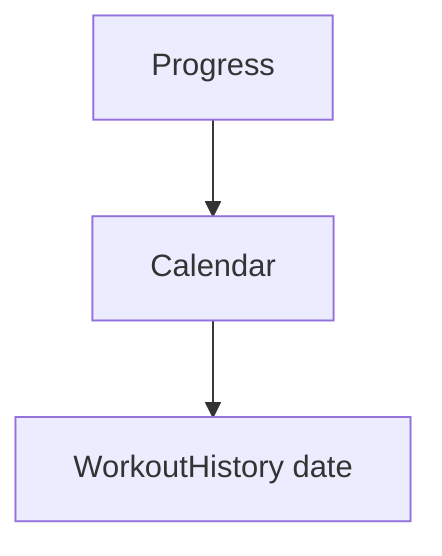

# Progress dan Riwayat — Personal Feature Documentation
## 0. Metadata
|Field|Detail|
|---|---|
|**Nama Fitur**|Progress dan riwayat|
|**Status**|`Implemented`|
|**Versi Dokumen**|v1.0|
|**Tanggal Dibuat / Update**|2026-08-27|
|**Android Module / Flavor**|`:app`; demo, production|
|**Source Scope**|Progress tab, kalender, daily history|
|**Last Verified Against Commit**|`5b3dd1af81698b0e47de8db598d5cba694907a65`|
|**Confidence Summary**|Verified|
## 1. Ringkasan dan Tujuan
Progress menghitung total volume, durasi minggu berjalan, kalender aktivitas, riwayat tanggal, dan detail exercise dari log selesai.
**Tujuan utama**: melihat tren dan riwayat workout lokal.
**Di luar cakupan**: live auto-refresh: tidak ada.
## 2. Entry Point dan User Flow
**Entry point**: `MainScreen` tab Progress.

1. VM memuat current user dan logs.
2. Tanggal ber-workout membuka `WorkoutHistory`.
3. Yearly calendar membuka tanggal yang dipilih.
## 3. UI/UX dan Interaksi
|Screen / Composable|Perilaku aktual|Evidence|
|---|---|---|
|`ProgressScreen`|Shimmer, stats, kalender|`ProgressScreen.kt`|
|`WorkoutHistoryDetailScreen`|Daily aggregate/per-exercise/rest-day card|`WorkoutHistoryDetailScreen.kt:472`|
|`YearlyCalendarScreen`|Tahun hingga tahun berjalan|`YearlyCalendarScreen.kt`|
**State UI**: loading shimmer; guest/error zero stats/empty; tanggal tanpa log rest-day. Accessibility/adaptive UI: TODO/VERIFY.
## 4. Implementasi Teknis
|Peran|File / Symbol|Evidence|
|---|---|---|
|State|`ProgressViewModel.loadData`|`ProgressViewModel.kt:46`|
|Data|`getWorkoutLogs`, log mapping|`WorkoutRepositoryImpl.kt:513`|
|Storage|soft-delete filter logs|`WorkoutLogDao.kt:85`|
|Navigation|`WorkoutHistory`, `YearlyCalendar`|`NavGraph.kt:107-112,181-195`|
**State dan Data Flow**: screens -> own Progress VM -> repository snapshot -> Room logs -> UI.
**Storage, API, dan Dependency**: no remote call on screen; device timezone groups `startTime`.
## 5. Aturan Bisnis, Validasi, dan Edge Cases
|Skenario|Perilaku aktual / diharapkan|Evidence|Confidence|
|---|---|---|---|
|Weekly duration|Monday sampai hari ini di timezone perangkat|`ProgressViewModel.kt:46`|Verified|
|Clickable dates|Hanya tanggal dengan workout; today kosong highlighted tapi tidak clickable|`ProgressScreen.kt`|Verified|
|Exercise target|Progress bar diasumsikan 3 set|`WorkoutHistoryDetailScreen.kt:472`|Verified|
## 6. Android Platform, Security, dan Privacy
|Area|Detail|Evidence|Status|
|---|---|---|---|
|Storage|Room workout logs, data kesehatan lokal|`WorkoutRepositoryImpl.kt:513`|Verified|
## 7. Testing dan Manual QA
**Existing Tests**: tidak ada Progress/VM/calendar/navigation test; demo repository hanya basic completion.
### Manual QA Checklist
- [ ] Stats/log tanggal dan weekly boundary Senin.
- [ ] Empty/rest day, yearly navigation, timezone dekat tengah malam.
- [ ] Finish workout lalu re-enter Progress untuk refresh.
## 8. Performance dan Reliability
|Area|Implementasi aktual / risiko|Evidence|Tindakan lanjut|
|---|---|---|---|
|Refresh|Repository snapshot bukan Flow; load dua kali initial composition|`ProgressViewModel.kt`|Open|
## 9. Dependency, Risiko, dan TODO
**Bergantung pada**: Room workout repository, Navigation 3.
|Risiko / Pertanyaan / TODO|Evidence / Source|Status|
|---|---|---|
|History VM terpisah dapat menampilkan rest-day saat loading|screen/VM scope|Open|
## 10. Changelog
|Versi|Tanggal|Perubahan|Commit|
|---|---|---|---|
|v1.0|2026-08-27|Dokumen awal dibuat|`5b3dd1a`|
## 11. Referensi
- Source code: `presentation/ui/progress/`, `ProgressViewModel.kt`, `WorkoutRepositoryImpl.kt`.
- Design / screenshot: N/A.
- External API documentation: N/A.
- Existing documentation: `docs/features/imfit-features.md`.
## 12. Evidence Map
|Claim|Source|Evidence Type|Confidence|
|---|---|---|---|
|Progress groups logs by device local date|`ProgressViewModel.kt:46`|code|Verified|
## 13. Coverage Map
|Area|Files Inspected|Coverage|Notes|
|---|---:|---|---|
|UI / Compose|3|Verified|Progress/history/calendar|
|State / ViewModel|1|Verified|Stats|
|Data / storage / API|2|Verified|Repo/DAO|
|Navigation / DI|1|Verified|Routes|
|Android platform|0|N/A|Tidak ada khusus|
|Tests|1|Partial|Demo repository|
