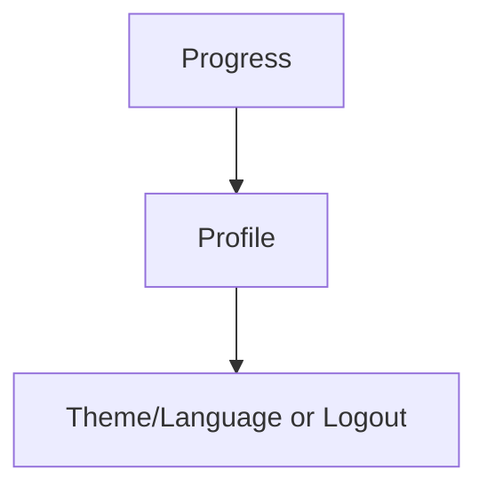

# Profil dan Preferensi — Personal Feature Documentation
## 0. Metadata
|Field|Detail|
|---|---|
|**Nama Fitur**|Profil dan preferensi|
|**Status**|`Implemented`|
|**Versi Dokumen**|v1.0|
|**Tanggal Dibuat / Update**|2026-08-27|
|**Android Module / Flavor**|`:app`; demo, production|
|**Source Scope**|Profile, tema, locale|
|**Last Verified Against Commit**|`5b3dd1af81698b0e47de8db598d5cba694907a65`|
|**Confidence Summary**|Verified|
## 1. Ringkasan dan Tujuan
Profil menampilkan data akun/avatar serta switch tema dan bahasa; keduanya tersimpan lokal. Data profil saat ini read-only dari UI.
**Tujuan utama**: melihat akun dan mengubah tampilan/bahasa.
**Di luar cakupan**: layar edit profil aktif: tidak ada.
## 2. Entry Point dan User Flow
**Entry point**: Progress -> `Profile`.

1. Load user melalui `ProgressViewModel`.
2. Avatar path production menjadi signed URL.
3. Toggle menyimpan preference; logout kembali Login.
## 3. UI/UX dan Interaksi
|Screen / Composable|Perilaku aktual|Evidence|
|---|---|---|
|`ProfileScreen`|Nama/email/birth date/avatar, switch, logout|`ProfileScreen.kt:74-237`|
|`IMFITThemeSwitch`, `IMFITLanguageSwitch`|Kontrol preference|`components/common/`|
**State UI**: user tidak ada memakai “Guest”; error/loading khusus: N/A. Accessibility/adaptive UI: TODO/VERIFY.
## 4. Implementasi Teknis
|Peran|File / Symbol|Evidence|
|---|---|---|
|State|`ProgressViewModel.loadData`|`ProgressViewModel.kt:46-126`|
|Preferences|`ThemeManager`, `LocaleManager`|`theme/ThemeManager.kt`, `LocaleManager.kt`|
|Data|`AuthRepository.getCurrentUser/updateProfile`|`AuthRepositoryImpl.kt:315-330`|
|Navigation|`Profile`, `resetTo(Login)`|`NavGraph.kt:197-205`|
**State dan Data Flow**: Profile -> Progress VM/Auth repo -> user; switches -> manager -> Preferences DataStore.
**Storage, API, dan Dependency**: `imfit_theme`/`is_dark_mode`; `imfit_locale`/`language`; profile API update has no UI caller.
## 5. Aturan Bisnis, Validasi, dan Edge Cases
|Skenario|Perilaku aktual / diharapkan|Evidence|Confidence|
|---|---|---|---|
|No user|UI Guest|`ProgressViewModel.kt:46-126`|Verified|
|Profile update|Repository exists, UI tidak memanggil|`AuthRepositoryImpl.kt:315-330`|Verified|
|Locale legacy|Migrasi SharedPreferences lama|`LocaleManager.kt:38-62`|Verified|
## 6. Android Platform, Security, dan Privacy
|Area|Detail|Evidence|Status|
|---|---|---|---|
|Storage|Preferences DataStore|`ThemeManager.kt:15-30`, `LocaleManager.kt`|Verified|
|Backup|Rules template masih TODO|`res/xml/data_extraction_rules.xml`, `backup_rules.xml`|TODO/VERIFY|
## 7. Testing dan Manual QA
**Existing Tests**: test tema/locale/profile UI tidak ditemukan.
### Manual QA Checklist
- [ ] Cek profil/avatar user dan Guest.
- [ ] Toggle tema, bahasa, relaunch aplikasi.
- [ ] Logout dari profil dan cek back stack.
## 8. Performance dan Reliability
|Area|Implementasi aktual / risiko|Evidence|Tindakan lanjut|
|---|---|---|---|
|DataStore|`LocaleManager` memakai `runBlocking` dan API Resources deprecated|`LocaleManager.kt:48-78`|Open|
## 9. Dependency, Risiko, dan TODO
**Bergantung pada**: Preferences DataStore, Coil avatar, AuthRepository.
|Risiko / Pertanyaan / TODO|Evidence / Source|Status|
|---|---|---|
|Edit profile belum terhubung|`NavGraph.kt`, `ProfileScreen.kt`|Open|
## 10. Changelog
|Versi|Tanggal|Perubahan|Commit|
|---|---|---|---|
|v1.0|2026-08-27|Dokumen awal dibuat|`5b3dd1a`|
## 11. Referensi
- Source code: `ProfileScreen.kt`, `ThemeManager.kt`, `LocaleManager.kt`.
- Design / screenshot: N/A.
- External API documentation: N/A.
- Existing documentation: `docs/features/imfit-features.md`.
## 12. Evidence Map
|Claim|Source|Evidence Type|Confidence|
|---|---|---|---|
|Theme disimpan DataStore|`ThemeManager.kt:15-30`|code|Verified|
## 13. Coverage Map
|Area|Files Inspected|Coverage|Notes|
|---|---:|---|---|
|UI / Compose|3|Verified|Profile/switches|
|State / ViewModel|1|Verified|User load|
|Data / storage / API|3|Verified|Auth/DataStore|
|Navigation / DI|1|Verified|Profile route|
|Android platform|2|Partial|Backup rules|
|Tests|0|N/A|Tidak ditemukan|
