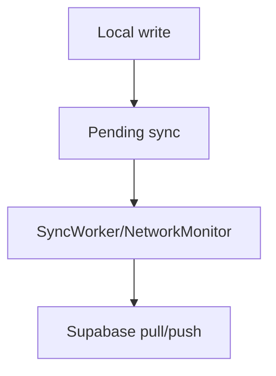

# Penyimpanan Lokal dan Sinkronisasi Cloud — Personal Feature Documentation
## 0. Metadata
|Field|Detail|
|---|---|
|**Nama Fitur**|Penyimpanan lokal dan sinkronisasi cloud|
|**Status**|`Implemented` (production); `N/A` cloud pada demo|
|**Versi Dokumen**|v1.0|
|**Tanggal Dibuat / Update**|2026-08-27|
|**Android Module / Flavor**|`:app`; `production` fokus; `demo` no-op|
|**Source Scope**|Room-first repository, Supabase sync, WorkManager|
|**Last Verified Against Commit**|`5b3dd1af81698b0e47de8db598d5cba694907a65`|
|**Confidence Summary**|Verified|
## 1. Ringkasan dan Tujuan
Production menulis template/log ke Room terlebih dahulu dengan status pending, lalu menyinkronkan Supabase saat jaringan tersedia. Demo memakai data memory dan sync no-op.
**Tujuan utama**: workout tetap tersimpan lokal saat offline dan berubah ke cloud saat online.
**Di luar cakupan**: backup manual dan resolusi konflik interaktif: N/A.
## 2. Entry Point dan User Flow
**Entry point**: login/registrasi, perubahan template, dan finish workout menjadwalkan sync.

1. Transaction Room membuat pending CREATE/UPDATE/DELETE.
2. Unique per-user WorkManager work atau network online menjalankan sync.
3. Push pending aggregate lalu pull remote data.
## 3. UI/UX dan Interaksi
|Screen / Composable|Perilaku aktual|Evidence|
|---|---|---|
|`SyncIndicator`|State sync pada Home|`components/common/SyncIndicator.kt`|
|`SyncProgressDialog`|Memblokir Main saat initial sync|`SyncProgressDialog.kt`|
**State UI**: `IDLE`, `SYNCING`, `SYNCED`, `FAILED`, `OFFLINE`, pending count/progress. Accessibility/adaptive UI: TODO/VERIFY.
## 4. Implementasi Teknis
|Peran|File / Symbol|Evidence|
|---|---|---|
|Storage|`IMFITDatabase` v6 / Room migrations|`IMFITDatabase.kt`, `DatabaseModule.kt`|
|Data|`WorkoutRepositoryImpl` local-first|`WorkoutRepositoryImpl.kt:132-177,384`|
|Sync|`SyncManager`, `SyncWorker`, scheduler|`data/sync/`, `WorkManagerSyncScheduler.kt`|
|DI/runtime|production `AppModule`, Hilt worker factory|`src/production/.../di/AppModule.kt`, `ImFitApplication.kt`|
**State dan Data Flow**: UI/repository write -> Room pending metadata -> scheduler/network monitor -> SyncManager/Supabase -> Room sync state.
**Storage, API, dan Dependency**: `imfit_database`; Supabase Auth/PostgREST/Storage; WorkManager connected constraint, exponential retry 10 seconds, `APPEND_OR_REPLACE`.
## 5. Aturan Bisnis, Validasi, dan Edge Cases
|Skenario|Perilaku aktual / diharapkan|Evidence|Confidence|
|---|---|---|---|
|Conflict|Local pending menang; synced local dibanding last-write-wins|`SyncManager.kt`|Verified|
|Exercises|Server-authoritative|`SyncManager.kt`|Verified|
|Worker failure|Retryable menjadi `Result.retry()`|`SyncWorker.kt`|Verified|
|Pull detail|Existing remote children tidak diupdate/deleted locally|`SyncManager.kt`|Verified|
## 6. Android Platform, Security, dan Privacy
|Area|Detail|Evidence|Status|
|---|---|---|---|
|Permission|Internet/network-state|`AndroidManifest.xml:5-6`|Verified|
|Worker|WorkManager initializer removed; Hilt factory supplied|`AndroidManifest.xml:53-61`, `ImFitApplication.kt`|Verified|
|Credentials|Supabase URL/key from `local.properties` BuildConfig|`app/build.gradle.kts:47-68`|Verified|
## 7. Testing dan Manual QA
**Existing Tests**: `WorkoutRepositoryRoomFirstTest.kt` transaction/pending behavior; `IMFITDatabaseMigrationTest` migration active-session 4->6. No SyncManager/worker/Supabase conflict test.
### Manual QA Checklist
- [ ] Create/edit/delete/finish offline lalu connect network.
- [ ] Cek pending indicator, initial sync, retry failure.
- [ ] Uji conflict pending dan remote updated/deleted child data.
## 8. Performance dan Reliability
|Area|Implementasi aktual / risiko|Evidence|Tindakan lanjut|
|---|---|---|---|
|Pull|Disebut delta tetapi request tidak difilter timestamp tersimpan|`SyncManager.kt`, `SyncPreferences.kt`|Open|
## 9. Dependency, Risiko, dan TODO
**Bergantung pada**: Room, DataStore, WorkManager/Hilt Work, Supabase, Ktor.
|Risiko / Pertanyaan / TODO|Evidence / Source|Status|
|---|---|---|
|Pending count tidak mencakup child rows|`SyncManager.kt`|Open|
## 10. Changelog
|Versi|Tanggal|Perubahan|Commit|
|---|---|---|---|
|v1.0|2026-08-27|Dokumen awal dibuat|`5b3dd1a`|
## 11. Referensi
- Source code: `data/sync/`, `WorkoutRepositoryImpl.kt`, `src/production/`.
- Design / screenshot: N/A.
- External API documentation: N/A.
- Existing documentation: `docs/features/imfit-features.md`.
## 12. Evidence Map
|Claim|Source|Evidence Type|Confidence|
|---|---|---|---|
|Workout finish is local transaction then enqueue sync|`WorkoutRepositoryImpl.kt:384`|code|Verified|
## 13. Coverage Map
|Area|Files Inspected|Coverage|Notes|
|---|---:|---|---|
|UI / Compose|2|Verified|Sync UI|
|State / ViewModel|1|Partial|Sync state provider|
|Data / storage / API|6|Verified|Room/repo/Supabase|
|Navigation / DI|3|Verified|Production/Hilt worker|
|Android platform|2|Verified|Manifest/worker|
|Tests|2|Partial|No sync worker|
