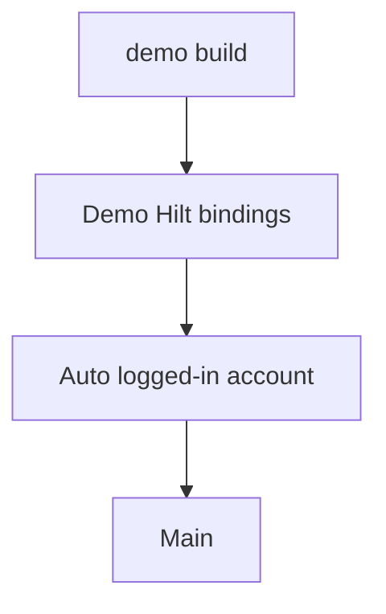

# Mode Demo — Personal Feature Documentation
## 0. Metadata
|Field|Detail|
|---|---|
|**Nama Fitur**|Mode demo|
|**Status**|`Implemented`|
|**Versi Dokumen**|v1.0|
|**Tanggal Dibuat / Update**|2026-08-27|
|**Android Module / Flavor**|`:app`; `demo` flavor|
|**Source Scope**|In-memory repositories dan demo account|
|**Last Verified Against Commit**|`5b3dd1af81698b0e47de8db598d5cba694907a65`|
|**Confidence Summary**|Verified|
## 1. Ringkasan dan Tujuan
Flavor demo menyediakan akun otomatis dan repository in-memory/no-op agar alur aplikasi dapat dicoba tanpa backend production.
**Tujuan utama**: menjalankan aplikasi tanpa Supabase/Room production.
**Di luar cakupan**: parity perilaku production: tidak dijamin.
## 2. Entry Point dan User Flow
**Entry point**: build/install variant `demo`.

1. Gradle memilih `demo` source set/package suffix.
2. Hilt mengikat fake repositories dan no-op sync.
3. `DemoAuthRepository` menginisialisasi user demo logged-in.
## 3. UI/UX dan Interaksi
|Screen / Composable|Perilaku aktual|Evidence|
|---|---|---|
|Auth/Main screens|Menggunakan UI sama dengan production|`presentation/`|
**State UI**: akun awal `demo@imfit.com`/`password123`; hint credential resource tidak dirender LoginScreen. Accessibility/adaptive UI: TODO/VERIFY.
## 4. Implementasi Teknis
|Peran|File / Symbol|Evidence|
|---|---|---|
|Config|`productFlavors.demo` package/version suffix|`app/build.gradle.kts:33-43`|
|DI|demo `AppModule`|`src/demo/.../di/AppModule.kt:19-45`|
|Data|`DemoAuthRepository`, fake sources, `DemoWorkoutRepository`|`src/demo/`, `data/local/Fake*`|
|Sync|`DemoSyncStateProvider` no-op|`src/demo/.../DemoSyncStateProvider.kt`|
**State dan Data Flow**: UI -> shared VMs -> demo Hilt repos -> singleton in-memory source -> UI.
**Storage, API, dan Dependency**: no Room/cloud sync production in demo; URI avatar retained locally without upload.
## 5. Aturan Bisnis, Validasi, dan Edge Cases
|Skenario|Perilaku aktual / diharapkan|Evidence|Confidence|
|---|---|---|---|
|Initial session|Always logged-in for fresh process|`DemoAuthRepository.kt:10-49`|Verified|
|Logout|Hanya sampai process berakhir|`FakeUserDataSource.kt:5-64`|Verified|
|Register photo|Menyimpan URI, tidak upload/sign|`FakeUserDataSource.kt:21-43`|Verified|
## 6. Android Platform, Security, dan Privacy
|Area|Detail|Evidence|Status|
|---|---|---|---|
|Storage/session|Memory process-only; bukan persistence aman|`FakeUserDataSource.kt`|Verified|
## 7. Testing dan Manual QA
**Existing Tests**: `src/testDemo/.../DemoRepositoriesTest.kt` mencakup auth, exercise, workout, sync idle; Room instrumented test memakai fake auth.
### Manual QA Checklist
- [ ] Install demo, splash menuju Main.
- [ ] Logout/login demo credential dan restart app.
- [ ] Buat data lalu restart untuk memastikan data hilang.
## 8. Performance dan Reliability
|Area|Implementasi aktual / risiko|Evidence|Tindakan lanjut|
|---|---|---|---|
|Parity|Auth/session/avatar/storage berbeda material dari production|demo modules|Open|
## 9. Dependency, Risiko, dan TODO
**Bergantung pada**: flavor Gradle dan Hilt bindings demo.
|Risiko / Pertanyaan / TODO|Evidence / Source|Status|
|---|---|---|
|Credential resource tidak tampil sebagai hint|`strings.xml`, `LoginScreen.kt`|Open|
## 10. Changelog
|Versi|Tanggal|Perubahan|Commit|
|---|---|---|---|
|v1.0|2026-08-27|Dokumen awal dibuat|`5b3dd1a`|
## 11. Referensi
- Source code: `src/demo/`, `data/local/FakeUserDataSource.kt`.
- Design / screenshot: N/A.
- External API documentation: N/A.
- Existing documentation: `docs/features/imfit-features.md`.
## 12. Evidence Map
|Claim|Source|Evidence Type|Confidence|
|---|---|---|---|
|Demo bindings replace auth/workout/exercise/sync|`src/demo/.../di/AppModule.kt`|code|Verified|
## 13. Coverage Map
|Area|Files Inspected|Coverage|Notes|
|---|---:|---|---|
|UI / Compose|1|Partial|Shared UI|
|State / ViewModel|0|Inferred|Shared injection|
|Data / storage / API|4|Verified|In-memory/no-op|
|Navigation / DI|2|Verified|Flavor/Hilt|
|Android platform|0|N/A|Tidak ada khusus|
|Tests|2|Verified|Demo and Room test|
