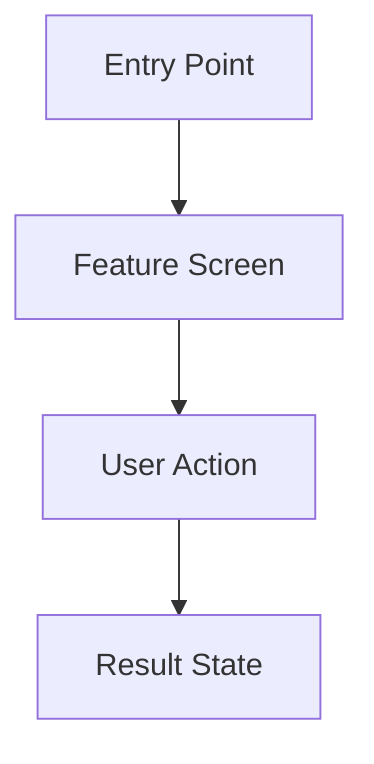

# [Nama Fitur] — Personal Feature Documentation

> **Cara pakai:** Duplikat file ini ke `docs/features/<nama-fitur>-personal-light.md`. Isi berdasarkan source code, test, manifest, resource, dan konfigurasi yang benar-benar ditemukan. Gunakan `N/A` atau `TODO/VERIFY` jika belum ada evidence.

---

## 0. Metadata

| Field | Detail |
| --- | --- |
| **Nama Fitur** | |
| **Status** | `Planned` / `In Progress` / `Implemented` / `Deprecated` / `Partial` |
| **Versi Dokumen** | v1.0 |
| **Tanggal Dibuat** | |
| **Tanggal Update Terakhir** | |
| **Android Module / Flavor** | |
| **Source Scope** | |
| **Last Verified Against Commit** | |
| **Confidence Summary** | Verified / Partial / Inferred / TODO/VERIFY |

---

## 1. Ringkasan dan Tujuan

_(1–3 kalimat: fitur apa, siapa yang menggunakannya, dan manfaat aktualnya berdasarkan code/test/context user.)_

**Tujuan utama**

-

**Di luar cakupan**

- N/A / TODO/VERIFY

---

## 2. Entry Point dan User Flow

**Entry point**

- _(Menu, screen, notification, deep link, atau flow lain yang diverifikasi.)_



**Alur utama**

1. 
2. 
3. 

---

## 3. UI/UX dan Interaksi

| Screen / Composable | Perilaku aktual | Evidence |
| --- | --- | --- |
| | | |

**Interaksi utama**

-

**State UI**

| State | Tampilan / Perilaku | Evidence |
| --- | --- | --- |
| Loading | | |
| Success / Content | | |
| Empty | N/A / | |
| Error | N/A / | |

**Accessibility dan adaptive UI**

- [ ] Label/content description diverifikasi
- [ ] Target sentuh sesuai kebutuhan diverifikasi
- [ ] Dynamic font scale diuji/diverifikasi
- [ ] N/A / TODO/VERIFY bila belum ada evidence

---

## 4. Implementasi Teknis

### Architecture dan File Utama

```text
app/src/main/java/.../
```

| Peran | File / Symbol | Evidence |
| --- | --- | --- |
| UI | | |
| State / ViewModel | | |
| Data / Repository | | |
| Navigation | | |
| DI / Runtime wiring | | |

### State dan Data Flow

```text
UI -> ViewModel/state -> repository -> local/remote source -> UI state
```

_(Hapus layer yang tidak ada; jangan menebak.)_

### Navigation

| Navigation Key / Route | Destination | Parameter | Evidence |
| --- | --- | --- | --- |
| | | | |

### Storage, API, dan Dependency

| Area | Implementasi | Evidence | Confidence |
| --- | --- | --- | --- |
| Local storage | N/A / | | |
| Network / API | N/A / | | |
| Dependency baru / penting | N/A / | | |

---

## 5. Aturan Bisnis, Validasi, dan Edge Cases

**Aturan / validasi utama**

-

| Skenario | Perilaku aktual / diharapkan | Evidence | Confidence |
| --- | --- | --- | --- |
| Input tidak valid | | | |
| Data kosong | N/A / | | |
| Error local/network | N/A / | | |
| Kondisi ulang / retry | N/A / | | |

---

## 6. Android Platform, Security, dan Privacy

| Area | Detail | Evidence | Status |
| --- | --- | --- | --- |
| Permission | N/A / | | |
| Service / worker / notification | N/A / | | |
| Data sensitif | N/A / | | |
| Storage / session | N/A / | | |
| Manifest / platform integration | N/A / | | |

---

## 7. Testing dan Manual QA

### Existing Tests

| Test File | Type | Coverage / Evidence |
| --- | --- | --- |
| | Unit / Compose UI / Instrumented | |

### Manual QA Checklist

- [ ] Main user flow berfungsi
- [ ] Loading, error, dan empty state relevan diuji
- [ ] Input / validasi relevan diuji
- [ ] Navigasi kembali dan state restore relevan diuji
- [ ] Light/dark mode relevan diuji
- [ ] Font scale atau ukuran layar relevan diuji
- [ ] Tidak ada regresi pada fitur terkait

---

## 8. Performance dan Reliability

| Area | Implementasi aktual / risiko | Evidence | Tindakan lanjut |
| --- | --- | --- | --- |
| Recomposition / rendering | | | |
| Network / cache / database | N/A / | | |
| Background work | N/A / | | |

---

## 9. Dependency, Risiko, dan TODO

**Bergantung pada**

-

| Risiko / Pertanyaan / TODO | Evidence / Source | Status |
| --- | --- | --- |
| | | Open / Resolved |

---

## 10. Changelog

| Versi | Tanggal | Perubahan | Commit |
| --- | --- | --- | --- |
| v1.0 | | Dokumen awal dibuat | |

---

## 11. Referensi

- Source code:
- Design / screenshot: N/A / 
- External API documentation: N/A / 
- Existing documentation:

---

## 12. Evidence Map

| Claim | Source | Evidence Type | Confidence |
| --- | --- | --- | --- |
| | | code/test/config/manifest/resource | Verified/Partial/Inferred/TODO |

---

## 13. Coverage Map

| Area | Files Inspected | Coverage | Notes |
| --- | ---: | --- | --- |
| UI / Compose | 0/0 | N/A | |
| State / ViewModel | 0/0 | N/A | |
| Data / storage / API | 0/0 | N/A | |
| Navigation / DI | 0/0 | N/A | |
| Android platform | 0/0 | N/A | |
| Tests | 0/0 | N/A | |
