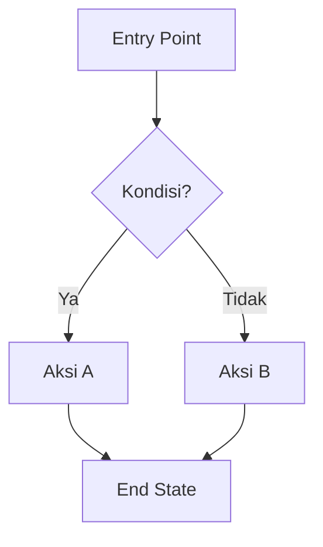

# [Nama Fitur] — Feature Documentation

> **Cara pakai template ini:** Duplikat file ini untuk setiap fitur baru, simpan di `docs/features/<nama-fitur>.md`, lalu isi setiap bagian. Hapus catatan bertanda `_(instruksi)_` setelah diisi. Bagian yang tidak relevan boleh ditulis `N/A` — jangan dihapus, agar struktur dokumen tetap konsisten antar fitur.

---

## 0. Metadata

| Field                            | Detail                                                                                                           |
| -------------------------------- | ---------------------------------------------------------------------------------------------------------------- |
| **Nama Fitur**                   |                                                                                                                  |
| **Feature ID / Ticket**          | (JIRA-123 / GitHub Issue #)                                                                                      |
| **Status**                       | `Draft` / `In Review` / `In Progress` / `Done` / `Deprecated` / `Implemented - Untested` / `Partial` / `Unknown` |
| **Versi Dokumen**                | v1.0                                                                                                             |
| **Penulis**                      | `Iskandar Muhaemin`                                                                                              |
| **Tanggal Dibuat**               |                                                                                                                  |
| **Tanggal Update Terakhir**      |                                                                                                                  |
| **Target Rilis**                 | (versi app / sprint)                                                                                             |
| **Platform**                     | `Android` / `Android Automotive` / `Wear OS` / `All`                                                             |
| **Project Topology**             | Single Android app / Multi-module Android project / Android monorepo / Unknown                                   |
| **Source Scope**                 | Folder/file utama yang diinspeksi                                                                                |
| **Last Verified Against Commit** | Git SHA jika tersedia                                                                                            |
| **Confidence Summary**           | Verified / Partial / Inferred / TODO/VERIFY                                                                      |

---

## 1. Ringkasan (Overview)

_(1–3 kalimat: fitur ini apa, untuk siapa, dan kenapa dibuat.)_

**Problem Statement**
_(Masalah apa yang dipecahkan oleh fitur ini?)_

**Tujuan (Goals)**

- Tujuan 1
- Tujuan 2

**Di Luar Cakupan (Non-Goals / Out of Scope)**

- ...

---

## 2. User Stories & Acceptance Criteria

### User Story

```
Sebagai [role/persona],
Saya ingin [melakukan aksi],
Agar [mendapat manfaat/tujuan].
```

### Acceptance Criteria

_(Format Given–When–Then, buat per skenario)_

- [ ] **AC-1:** Given ..., When ..., Then ...
- [ ] **AC-2:** Given ..., When ..., Then ...
- [ ] **AC-3:** Given ..., When ..., Then ...

---

## 3. User Flow

_(Diagram alur pengguna — bisa embed gambar, link Figma, atau Mermaid diagram)_



**Entry Points:** _(dari mana user bisa mengakses fitur ini — menu, deep link, notifikasi, dll.)_

---

## 4. UI/UX Specification

| Screen / Widget | Deskripsi | Design Link |
| --------------- | --------- | ----------- |
| `NamaScreen1`   |           | Figma:      |
| `NamaScreen2`   |           | Figma:      |

**Design Reference:** (link Figma / Zeplin)

**Komponen UI Baru vs Reuse**

- Baru: `WidgetX`, `WidgetY`
- Reuse: `SharedButton`, `AppBarCustom`

**Responsive & Adaptive Notes**
_(Perilaku di tablet, layar besar, orientasi landscape, dll.)_

**Accessibility (a11y)**

- [ ] Semantic labels untuk screen reader
- [ ] Kontras warna sesuai WCAG AA
- [ ] Target sentuh minimum 48x48dp
- [ ] Support dynamic text scaling

---

## 5. Technical Design

### 5.1 Architecture Overview

_(Pattern yang dipakai: Clean Architecture / MVVM / MVI / repository pattern, dsb.)_

```text
app/src/main/java/com/example/app/
├── data/
│   ├── local/              # Room, DataStore, DAO
│   ├── remote/             # API client, DTO
│   └── repository/
├── domain/
│   ├── model/
│   └── repository/
├── presentation/
│   ├── ui/                 # Compose screens
│   ├── components/
│   └── navigation/
├── di/                     # Hilt modules
└── core/                   # platform and shared services
```

### 5.2 State Management

| Item               | Detail                                          |
| ------------------ | ----------------------------------------------- |
| **Solution**       | `ViewModel + StateFlow` / `LiveData` / MVI / lainnya |
| **State Class**    | `FeatureUiState`                                    |
| **Events/Actions** | `onAction()`, `SharedFlow`, `Channel`, atau lainnya  |
| **Key States**     | `Loading`, `Success`, `Error`, `Empty`          |

### 5.3 Data Layer

**Models / Entities**

```kotlin
data class FeatureModel(
    val id: String,
    val name: String
)
```

**Data Source**

- [ ] Remote (API)
- [ ] Local (Room / DataStore / file / cache)

### 5.4 API Contract

| Method | Endpoint      | Deskripsi |
| ------ | ------------- | --------- |
| `GET`  | `/api/v1/...` |           |
| `POST` | `/api/v1/...` |           |

**Contoh Request**

```json
{
  "key": "value"
}
```

**Contoh Response**

```json
{
  "status": "success",
  "data": {}
}
```

**Error Codes**
| Code | Arti | Penanganan di App |
|---|---|---|
| 400 | Bad Request | |
| 401 | Unauthorized | |
| 500 | Server Error | |

### 5.5 Routing / Navigation

| Navigation Key / Route | Destination | Parameter    |
| ---------------------- | ----------- | ------------ |
| `FeatureRoute`         | `FeatureScreen` | `id: String` |

### 5.6 Dependencies (Package Baru)

| Package | Versi | Alasan Penggunaan |
| ------- | ----- | ----------------- |
|         |       |                   |

---

## 6. Business Logic & Edge Cases

**Aturan Bisnis Utama**

- Rule 1
- Rule 2

**Edge Cases**
| Skenario | Perilaku yang Diharapkan |
|---|---|
| Tidak ada koneksi internet | |
| Data kosong | |
| Response API gagal / timeout | |
| Input tidak valid | |
| Session expired | |

**Error & Empty State Handling**
_(UI apa yang ditampilkan untuk masing-masing kondisi di atas)_

---

## 7. Permissions, Security & Privacy

- [ ] Membutuhkan permission Android khusus (kamera, lokasi, notifikasi, dll.) — sebutkan
- [ ] Menyimpan data sensitif — sebutkan jenis & metode enkripsi
- [ ] Autentikasi/otorisasi yang dibutuhkan
- [ ] Kepatuhan (GDPR / UU PDP) jika relevan

---

## 8. Analytics & Tracking

| Event Name         | Trigger               | Parameter           |
| ------------------ | --------------------- | ------------------- |
| `feature_opened`   | Saat screen dibuka    | `user_id`, `source` |
| `feature_action_x` | Saat aksi X dilakukan |                     |

---

## 9. Testing Plan

### Unit Test

- [ ] Test untuk usecase / bloc / logic utama
- [ ] Test untuk repository & data source

### Compose UI Test

- [ ] Test rendering UI sesuai state (loading, success, error, empty)
- [ ] Test interaksi user (tap, input, scroll)

### Integration / E2E Test

- [ ] Skenario alur utama end-to-end

### Manual QA Checklist

- [ ] Berfungsi pada Android version dan device target
- [ ] Berfungsi offline/online
- [ ] Berfungsi di berbagai ukuran layar
- [ ] Tidak ada regresi pada fitur terkait

---

## 10. Performance Considerations

_(Lazy loading, pagination, caching, image optimization, rebuild widget yang tidak perlu, dll.)_

---

## 11. Feature Flag & Rollout Plan

| Item                 | Detail                                         |
| -------------------- | ---------------------------------------------- |
| **Feature Flag**     | `feature_name_enabled`                         |
| **Rollout Strategy** | `Big Bang` / `Percentage Rollout` / `A/B Test` |
| **Rollback Plan**    |                                                |

---

## 12. Dependencies & Related Features

- **Bergantung pada:** (fitur/modul lain yang harus ada duluan)
- **Berdampak pada:** (fitur lain yang mungkin terpengaruh)

---

## 13. Open Questions & Risks

| Pertanyaan/Risiko | Status          | PIC |
| ----------------- | --------------- | --- |
|                   | Open / Resolved |     |

---

## 14. Changelog

| Versi | Tanggal | Perubahan           | Author |
| ----- | ------- | ------------------- | ------ |
| v1.0  |         | Dokumen awal dibuat |        |

---

## 15. Referensi

- Design (Figma):
- Ticket/Epic:
- API Documentation:
- Related PR/Branch:

---

## 16. Evidence Map

| Claim | Source | Evidence Type                                                              | Confidence                                |
| ----- | ------ | -------------------------------------------------------------------------- | ----------------------------------------- |
|       |        | code/test/config/comment/existing-doc/design/generated/inferred-from-model | Verified/Inferred/Partial/Unverified/TODO |

---

## 17. Coverage Map

| Area               | Files inspected | Coverage | Notes |
| ------------------ | --------------: | -------- | ----- |
| UI screens/widgets |             0/0 | N/A      |       |
| State management   |             0/0 | N/A      |       |
| Data/API           |             0/0 | N/A      |       |
| Routing/navigation |             0/0 | N/A      |       |
| DI/wiring          |             0/0 | N/A      |       |
| Localization       |             0/0 | N/A      |       |
| Analytics          |             0/0 | N/A      |       |
| Security/privacy   |             0/0 | N/A      |       |
| Tests              |             0/0 | N/A      |       |
